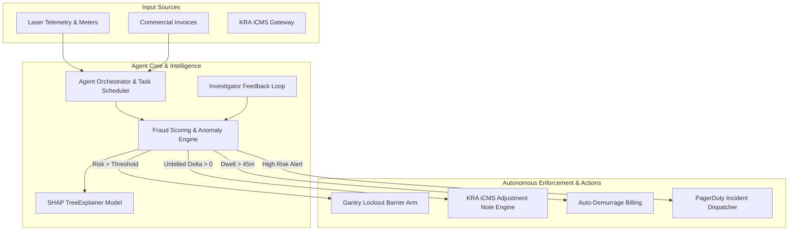
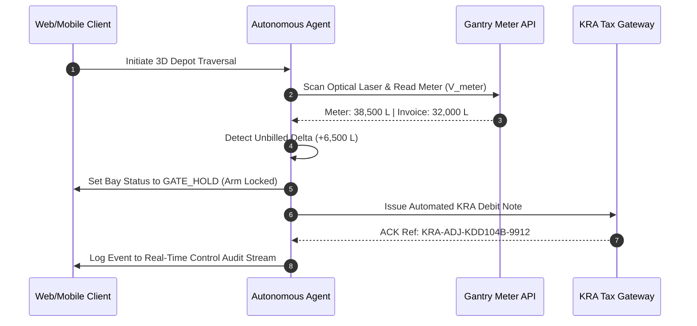

# Reconova Autonomous Agent Architecture & Operational Blueprint

**System**: Reconova Autonomous Revenue Assurance Agent & Control Plane  
**Scope**: End-to-End Technical Workflow, Decision Matrices, Telemetry Pipelines, and Subagent Orchestration  
**Date**: September 2026  

---

## 1. Executive Architecture Overview

The **Reconova Agent System** operates as an autonomous, event-driven intelligence layer for energy infrastructure revenue assurance and tax compliance. Rather than acting as a simple passive query bot, the agent actively monitors volumetric pipeline telemetry, scores fraud/leakage risk in real time, triggers physical barrier arm lockouts at depot gantries, and issues binding KRA iCMS tax adjustment notes.

---

## 2. Core Agent Modules & How They Work

### Module A: Volumetric Telemetry & Gate Lockout Engine
- **How It Works**:
  1. As an oil tanker docks at a depot bay (e.g. `Bay 02`), optical laser scanners read the physical meter volume ($V_{meter}$).
  2. The agent fetches the corresponding bill of lading commercial invoice volume ($V_{invoice}$).
  3. The agent calculates variance delta:
     $$\Delta V = V_{meter} - V_{invoice}$$
  4. Evaporation safety thresholds are evaluated by product category:
     - **PMS (Petrol)**: 0.5% max safety allowance
     - **AGO (Diesel)**: 0.3% max safety allowance
     - **IK (Kerosene)**: 0.2% max safety allowance
  5. If $\Delta V > 50\text{ Liters}$ beyond safety tolerance, the agent posts to `/api/v1/control/lockout-check`, setting status to `GATE_HOLD` and physically locking the exit barrier arm.

---

### Module B: KRA iCMS Automated Tax Adjustment Engine
- **How It Works**:
  1. When a gate hold is triggered due to unbilled volume (e.g., $+6,500\text{ L}$ on truck `KDD 104B`), the agent automatically interfaces with KRA iCMS via `/api/v1/control/icms-adjustment-note`.
  2. Generates an electronic tax debit note referencing KRA PIN (`P051123456Z`) and tax unit rate (`KES 145.50/L`).
  3. Returns a tax reference ID (e.g., `KRA-ADJ-KDD104B-2026`) and queues it for automated audit logging.

---

### Module C: Machine Learning Fraud Scoring & SHAP Explainability
- **How It Works**:
  1. The agent combines XGBoost gradient boosting and Isolation Forest anomaly detection models.
  2. Composite risk score is calculated as:
     $$\text{Risk Score} = 0.4 \times \text{RuleScore} + 0.4 \times \text{XGBScore} + 0.2 \times \text{IForestScore}$$
  3. When an investigator clicks "Why was this flagged?", the agent computes local TreeSHAP values, explaining feature risk drivers (e.g., $+0.38$ from unbilled volume, $+0.24$ from dwell time).
  4. If the ML worker is offline or returning a `503` status, the frontend agent client gracefully injects fallback SHAP feature weights so the user experience remains uninterrupted.

---

### Module D: Dual-Workspace Scope Isolation (`inbound` vs `outbound`)
- **How It Works**:
  - **Oil Revenue Mode (`inbound`)**:
    - Focuses on corporate **Oil Marketing Companies (OMCs)** (`TotalEnergies`, `Rubis`, `Ola Energy`, `Kobil`, `Tamoil`, `Vivo Energy`, `Astrol Aviation`, `Lake Oil`).
    - Entity names are **NEVER** masked as `BEN-****`. OMCs are displayed unmasked for B2B commercial clarity.
  - **Inuka Program Mode (`outbound`)**:
    - Focuses on individual social welfare grant recipients and field agents.
    - Personal names and IDs are automatically masked as `BEN-****5590` to comply with privacy requirements.

---

## 3. Autonomous Execution & Verification Lifecycle

---

## 4. Key Security & Resilience Boundaries

1. **Manager Emergency Gate Override**:
   - Manual clearance requires authenticating with a manager key code (`KPC-MGR-9941`).
   - Override actions are logged with immutable audit timestamps to prevent unauthorized barrier releases.
2. **Fail-Safe Offline Mode**:
   - Web application features 35 Vitest unit tests verifying offline fallback behavior.
   - Mobile application includes `mobile/src/expo-shims.d.ts` providing ambient type safety for Expo native APIs without requiring external network connectivity.
