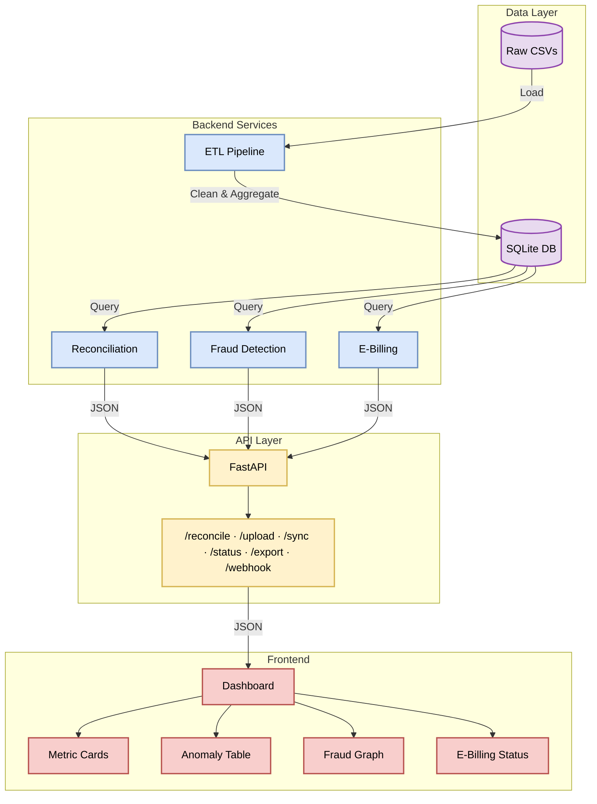

# KPC Revenue Assurance Platform

**Reconciliation engine for Kenya Pipeline Company**
Detects Order-to-Cash leakage and integrates with KRA's e-billing (iCMS) system.

## Overview

KPC loses revenue in its Order-to-Cash cycle through:

- **Missing invoices** — fuel dispatched, no bill sent
- **Missing payments** — bills sent, never paid
- **Underpayments** — paid less than invoiced

This platform reconciles Dispatches → Invoices → Payments, flags these breaks, and exposes the results via a REST API (with Swagger/OpenAPI docs). It also includes a simulated E-Billing integration with KRA iCMS: retry logic, a dead letter queue, webhook callbacks, and failure-rate monitoring.

## Architecture




`Fraud` and the `Fraud Graph` UI: `GET /api/graph` builds an OMC↔depot leakage graph and runs Louvain community detection to surface correlated-leakage clusters (see [Project Status](#project-status)).

## Key Features


| Feature                  | Description                                                                                                    |
| ------------------------ | -------------------------------------------------------------------------------------------------------------- |
| Three-way reconciliation | Matches Dispatches → Invoices → Payments to detect missing invoices, missing payments, and under/overpayments. |
| E-Billing integration    | Syncs invoices to KRA iCMS with retry logic (3 attempts, exponential backoff).                                 |
| Dead letter queue        | Failed invoices are stored for reprocessing rather than dropped.                                               |
| Webhook callback         | Simulates KRA's asynchronous confirmation of invoice processing.                                               |
| E-Billing dashboard      | Sync health: synced/pending/failed counts, reconciliation rate.                                                |
| Failure monitoring       | Alerts when the sync failure rate exceeds a configurable threshold.                                            |
| Materiality threshold    | Configurable filter to focus on significant leaks.                                                             |
| Duplicate detection      | Flags duplicate invoices/dispatches.                                                                           |
| OMC risk profiling       | Aggregates leakage per OMC and assigns a High/Medium/Low risk level.                                           |
| Data quality scoring     | 0-100% score based on nulls, zeros, and invalid customer references.                                           |
| CSV upload & templates   | Reconcile ad hoc CSVs without touching the database, or download templates for the expected format.            |
| Excel export             | Multi-sheet workbook report (summary, anomalies, data quality, risk profile).                                  |


## Tech Stack


| Layer                     | Technology                                            |
| ------------------------- | ----------------------------------------------------- |
| Backend                   | Python 3.11, FastAPI, Uvicorn                         |
| Data processing           | Pandas, NumPy, SQLAlchemy                             |
| Fraud detection (planned) | NetworkX, python-louvain                              |
| Database                  | SQLite (dev) / PostgreSQL (prod)                      |
| Testing                   | Pytest                                                |
| Frontend                  | Next.js (App Router), React, TypeScript, Tailwind CSS |
| Deployment                | Docker, Docker Compose                                |
| API docs                  | Swagger UI, ReDoc                                     |


## 👥 User Roles

| Role | Description | Key Features |

| :--- | :--- | :--- |

| **Depot Supervisor** | Operations Lead – manages daily depot activities. | Live Feed, Upload CSV, Dashboard Metrics |

| **Manager** | Strategic Decision Maker – oversees regional operations. | Heatmap, OMC Risk Profile, Executive Summary, Export Reports |

| **Revenue Assurance** | Financial Analyst – investigates and resolves anomalies. | Anomaly Table, Resolve/Review/Assign, Audit Trail, E-Billing Sync, Sync Logs |

### Permission Mapping

| Feature | Depot Supervisor | Manager | Revenue Assurance |

| :--- | :--- | :--- | :--- |

| Live Feed | ✅ | ✅ | ✅ |

| Upload CSV | ✅ | ❌ | ✅ |

| Heatmap | ❌ | ✅ | ✅ |

| OMC Risk Profile | ❌ | ✅ | ✅ |

| Executive Metrics | ✅ | ✅ | ✅ |

| Anomaly Table | ❌ | ✅ | ✅ |

| Resolve/Review/Assign | ❌ | ❌ | ✅ |

| E-Billing Sync | ❌ | ❌ | ✅ |

| Audit Trail | ❌ | ✅ | ✅ |

| Export Reports | ❌ | ✅ | ✅ |

| Templates | ✅ | ❌ | ✅ |

This matrix is enforced on both sides now, not just documented: every backend route requires the matching `require_permission(...)` (see `app/core/dependencies.py`), and `backend/scripts/seed_roles.py` seeds these exact permissions per role. The frontend's dashboard (`frontend/src/app/dashboard/`) reads a logged-in user's `permissions` array from `/api/auth/me` to decide what to show — but that's UX only; the API 403s independently of what the frontend renders.

## Quick Start


### Prerequisites

- Docker and Docker Compose, or
- Python 3.11+ and Node.js 20+ for local development


### With Docker

```bash
git clone git@github.com:TristanBrian/revenue-assurance.git
cd revenue-assurance
docker compose up --build
```

Backend: [http://localhost:8000](http://localhost:8000) · Swagger docs: [http://localhost:8000/docs](http://localhost:8000/docs)

### Local development

Auth requires PostgreSQL — `users`/`roles`/`permissions` use Postgres-native `UUID` columns, which SQLite has no type for. Point `DATABASE_URL` in your repo-root `.env` at a Postgres instance (any instance works; it doesn't have to be the system one — see `AUTH_NOTES.md`), then:

```bash
cd backend
python -m venv venv
source venv/bin/activate  # Windows: venv\Scripts\activate
pip install -r requirements.txt

python scripts/generate_kpc_data.py   # generate synthetic CSVs
python scripts/etl_pipeline.py        # loads to SQLite always, and to Postgres too if DATABASE_URL is a postgresql:// URI

alembic upgrade head                  # creates users/roles/permissions/user_roles/role_permissions
python scripts/seed_roles.py          # seeds the roles + permissions in the README's Permission Mapping table above

uvicorn app.main:app --reload --host 0.0.0.0 --port 8000
```

Create a user per role via `POST /api/auth/register` (`role_name`: `depot_supervisor` / `manager` / `revenue_assurance` / `system_admin`) — it's open with no auth required so the first `system_admin` can be created at all (see `AUTH_NOTES.md` for the bootstrap tradeoff this implies).

Frontend:

```bash
cd frontend
npm install
cp .env.local.example .env.local
npm run dev
```

Frontend: [http://localhost:3000](http://localhost:3000) — redirects to `/login`, then to the role-appropriate dashboard.

## API Endpoints


| Method | Endpoint                         | Description                                                           |
| ------ | -------------------------------- | --------------------------------------------------------------------- |
| POST   | `/api/auth/register`             | Create a user (open, no auth — see the bootstrap note above)          |
| POST   | `/api/auth/login`                | OAuth2 password flow — form fields `username` (email) + `password`    |
| GET    | `/api/auth/me`                   | Current user's id/email/roles/permissions                             |
| GET    | `/api/heatmap`                   | OMC × Product leakage matrix — `view_heatmap`                         |
| GET    | `/api/graph`                     | OMC↔depot leakage graph + community detection — `view_fraud_graph`    |
| GET    | `/api/feed`                      | Live anomaly feed (universal — any logged-in user)                    |
| POST   | `/api/reconcile`                 | Run reconciliation against the database — returns metrics + anomalies (anomaly detail requires `view_anomalies`, everything else is universal) |
| POST   | `/api/reconcile/upload`          | Run reconciliation against uploaded CSVs                              |
| POST   | `/api/reconcile/sync`            | Sync anomalies to E-Billing                                           |
| POST   | `/api/reconcile/update`          | Resolve/update an anomaly                                             |
| GET    | `/api/reconcile/export`          | Download an Excel report                                              |
| GET    | `/api/reconcile/template/{type}` | Download a CSV template                                               |
| GET    | `/api/e-billing/status`          | E-Billing integration status                                          |
| POST   | `/api/e-billing/sync`            | Sync invoices to KRA iCMS (synchronous)                               |
| POST   | `/api/e-billing/sync/async`      | Trigger a non-blocking background sync (returns `task_id`)            |
| GET    | `/api/e-billing/task/{task_id}`  | Poll async task progress and result                                   |
| POST   | `/api/e-billing/retry/{id}`      | Retry a failed sync                                                   |
| GET    | `/api/e-billing/logs`            | View sync audit logs                                                  |
| GET    | `/api/e-billing/pending`         | List pending invoices                                                 |
| POST   | `/api/e-billing/webhook`         | Simulate a KRA webhook callback                                       |
| GET    | `/api/e-billing/reconcile`       | E-Billing reconciliation dashboard                                    |
| GET    | `/api/e-billing/monitor`         | Failure rate monitoring                                               |
| GET    | `/health`                        | Service health check (DB + API status)                                |


Full interactive docs: [http://localhost:8000/docs](http://localhost:8000/docs) (Swagger) and [http://localhost:8000/redoc](http://localhost:8000/redoc) (ReDoc).

## Project Structure

```
revenue-assurance/
├── backend/
│   ├── app/
│   │   ├── main.py          # FastAPI entry point
│   │   ├── routes/          # API endpoints
│   │   ├── services/        # Business logic (reconciliation, e-billing)
│   │   ├── models/          # Pydantic schemas
│   │   └── utils/           # DB connection, data loading helpers
│   ├── scripts/              # Synthetic data generation + ETL
│   ├── data/                 # Raw/clean CSVs (gitignored)
│   ├── tests/
│   └── requirements.txt
├── frontend/
│   ├── src/
│   │   ├── app/               # Pages
│   │   ├── components/        # UI components
│   │   └── lib/                # API client, types
│   └── package.json
├── docker-compose.yml
└── PROGRESS.md                # Frontend/backend integration status
```

Team ownership by area:


| Area               | Owns                                        |
| ------------------ | ------------------------------------------- |
| Backend core & API | `main.py`, `routes/`, `models/`, deployment |
| Business logic     | `services/reconciliation.py`, `tests/`      |
| Data engineering   | `scripts/`, `data/`, `utils/`, ETL          |
| Frontend           | `app/`, `lib/`, `components/`               |


## Testing

```bash
docker compose exec backend pytest tests/ -v
docker compose exec backend pytest tests/ --cov=app.services --cov-report=term
```


## Sample Response

Reconciliation output (values vary by run — data is synthetically generated with randomized fraud injection):

```json
{
  "status": "success",
  "data": {
    "metrics": {
      "total_dispatched_kes": 150932276,
      "total_leakage_kes": 16686227,
      "reconciliation_rate": 88.94,
      "anomaly_count": 90,
      "critical_count": 84
    },
    "anomalies": [ "..." ],
    "omc_risk_profile": [ "..." ]
  }
}
```

E-Billing sync response:

```json
{
  "status": "success",
  "message": "Successfully synced 998 invoices, 110 failed.",
  "synced": 998,
  "failed": 110,
  "total_processed": 1108,
  "failed_ids": ["INV-1001"],
  "sync_time": "2026-07-22 08:15:00"
}
```


## Environment Variables

Copy `.env.example` to `.env` at the repo root:

```env
API_HOST=0.0.0.0
API_PORT=8000
CORS_ORIGINS=http://localhost:3000
MATERIALITY_THRESHOLD=100000
KRA_ICMS_ENDPOINT=https://api.kra.go.ke/icms/v2/invoices
KRA_ICMS_API_KEY=test-api-key-12345
LOG_LEVEL=INFO
```

Note: `MATERIALITY_THRESHOLD`, `CRITICAL_AGE_DAYS`, and the KRA endpoint/key are currently hardcoded constants in the backend services rather than read from these variables — update the constants directly in `app/services/reconciliation.py` and `app/services/e_billing.py` if you need to change them.

## Project Status

See [PROGRESS.md](./PROGRESS.md) for the current state of frontend/backend integration. In short: all 7 phases are complete — reconciliation dashboard, CSV upload, the E-Billing panel, Excel export, the fraud graph, and RBAC (backend enforcement + a role-based multi-dashboard frontend, replacing the single page that used to show every feature to every visitor) are all wired to live data and manually verified end-to-end as all 3 roles. CI (GitHub Actions) runs backend tests and frontend lint/typecheck/build on every push/PR to `main`.

## License

MIT. Built for the Inuka Hackathon 2026 by Null Terminators.