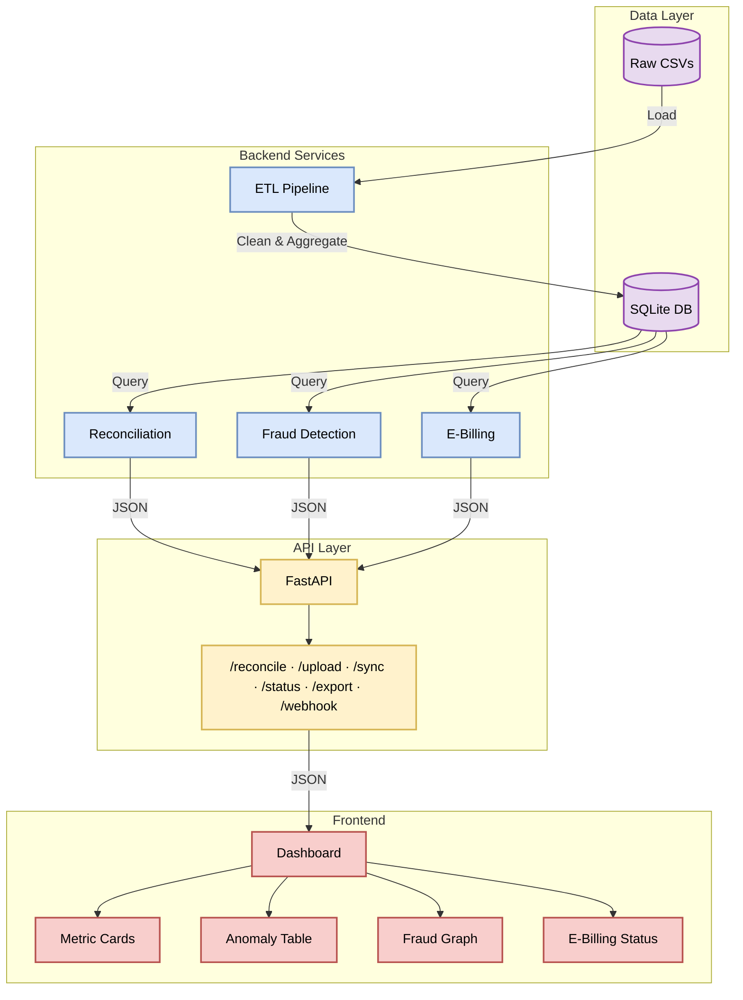

# KPC Revenue Assurance Platform

**Reconciliation engine for Kenya Pipeline Company**
Detects Order-to-Cash leakage and integrates with KRA's e-billing (iCMS) system.

## Overview

KPC loses revenue in its Order-to-Cash cycle through:

- **Missing invoices** — fuel dispatched, no bill sent
- **Missing payments** — bills sent, never paid
- **Underpayments** — paid less than invoiced

This platform reconciles Dispatches → Invoices → Payments, flags these breaks, and exposes the results via a REST API (with Swagger/OpenAPI docs). It also includes a simulated E-Billing integration with KRA iCMS: retry logic, a dead letter queue, webhook callbacks, and failure-rate monitoring.

## Architecture




`Fraud` and the `Fraud Graph` UI: `GET /api/graph` builds an OMC↔depot leakage graph and runs Louvain community detection to surface correlated-leakage clusters (see [Project Status](#project-status)).

## Key Features


| Feature                  | Description                                                                                                    |
| ------------------------ | -------------------------------------------------------------------------------------------------------------- |
| Three-way reconciliation | Matches Dispatches → Invoices → Payments to detect missing invoices, missing payments, and under/overpayments. |
| E-Billing integration    | Syncs invoices to KRA iCMS with retry logic (3 attempts, exponential backoff).                                 |
| Dead letter queue        | Failed invoices are stored for reprocessing rather than dropped.                                               |
| Webhook callback         | Simulates KRA's asynchronous confirmation of invoice processing.                                               |
| E-Billing dashboard      | Sync health: synced/pending/failed counts, reconciliation rate.                                                |
| Failure monitoring       | Alerts when the sync failure rate exceeds a configurable threshold.                                            |
| Materiality threshold    | Configurable filter to focus on significant leaks.                                                             |
| Duplicate detection      | Flags duplicate invoices/dispatches.                                                                           |
| OMC risk profiling       | Aggregates leakage per OMC and assigns a High/Medium/Low risk level.                                           |
| Data quality scoring     | 0-100% score based on nulls, zeros, and invalid customer references.                                           |
| CSV upload & templates   | Reconcile ad hoc CSVs without touching the database, or download templates for the expected format.            |
| Excel export             | Multi-sheet workbook report (summary, anomalies, data quality, risk profile).                                  |


## Tech Stack


| Layer                     | Technology                                            |
| ------------------------- | ----------------------------------------------------- |
| Backend                   | Python 3.11, FastAPI, Uvicorn                         |
| Data processing           | Pandas, NumPy, SQLAlchemy                             |
| Fraud detection (planned) | NetworkX, python-louvain                              |
| Database                  | SQLite (dev) / PostgreSQL (prod)                      |
| Testing                   | Pytest                                                |
| Frontend                  | Next.js (App Router), React, TypeScript, Tailwind CSS |
| Deployment                | Docker, Docker Compose                                |
| API docs                  | Swagger UI, ReDoc                                     |


## 👥 User Roles

Every API route except `POST /api/auth/login`, `POST /api/auth/register` (bootstrap-only), and `POST /api/e-billing/webhook` (an external KRA callback, not a user action) requires a JWT bearer token — obtain one via `POST /api/auth/login` with `{"email": ..., "password": ...}`. Roles and permissions are seeded with `python scripts/seed_roles.py`; the first `system_admin` account is bootstrapped separately with `python scripts/seed_admin.py` (see [Quick Start](#quick-start)).

| Role | Description | Key Features |
| :--- | :--- | :--- |
| **Depot Supervisor** | Operations Lead – manages daily depot activities. | Live Feed, Upload CSV & Templates, Executive Metrics |
| **Manager** | Strategic Decision Maker – oversees regional operations. | Live Feed, Heatmap, OMC Risk Profile, Executive Metrics, Anomaly Table, Export Reports |
| **Revenue Assurance** | Financial Analyst – investigates and resolves anomalies. | All Manager features + Upload CSV/Templates, Resolve/Review/Assign, E-Billing Sync, Fraud Graph, Risk Analytics |
| **System Admin** | Platform administrator. Scoped only to user management — no access to any revenue-assurance feature below. | Create/list/edit/delete users, assign roles |

Role names are matched loosely at registration/edit time rather than requiring an exact string: `"supervisor"`, `"depot"`, `"depo"` all map to `depot_supervisor`; `"man"`, `"manager"`, `"MANAGER"` map to `manager`; anything containing `"revenue"` or `"assurance"` maps to `revenue_assurance`.

### Permission Mapping

| Feature | Permission code | Depot Supervisor | Manager | Revenue Assurance |
| :--- | :--- | :---: | :---: | :---: |
| Live Feed | `view_live_feed` | ✅ | ✅ | ✅ |
| Upload CSV / Templates | `upload_csv` | ✅ | ❌ | ✅ |
| Heatmap | `view_heatmap` | ❌ | ✅ | ✅ |
| OMC Risk Profile | `view_omc_risk_profile` | ❌ | ✅ | ✅ |
| Executive Metrics | `view_metrics` | ✅ | ✅ | ✅ |
| Anomaly Table | `view_anomaly_table` | ❌ | ✅ | ✅ |
| Resolve/Review/Assign | `resolve_anomaly` | ❌ | ❌ | ✅ |
| E-Billing Sync | `manage_ebilling` | ❌ | ❌ | ✅ |
| Export Reports | `export_reports` | ❌ | ✅ | ✅ |
| Fraud Graph (structural network) | `view_fraud_graph` | ❌ | ❌ | ✅ |
| Risk Analytics (statistical/EDA) | `view_risk_analytics` | ❌ | ❌ | ✅ |

`manage_users` and `manage_permissions` gate user administration (`/api/admin/*`) and are held only by `system_admin` — not shown above since they're not a revenue-assurance feature.

> **Note:** Audit Trail is not yet implemented (no backing data model or route) and has been descoped from the matrix above until it exists.

## Quick Start


### Prerequisites

- Docker and Docker Compose, or
- Python 3.11+ and Node.js 20+ for local development


### With Docker

```bash
git clone git@github.com:TristanBrian/revenue-assurance.git
cd revenue-assurance
docker compose up --build
```

Backend: [http://localhost:8000](http://localhost:8000) · Swagger docs: [http://localhost:8000/docs](http://localhost:8000/docs)

### Local development

Backend:

```bash
cd backend
python -m venv venv
source venv/bin/activate  # Windows: venv\Scripts\activate
pip install -r requirements.txt

python scripts/generate_kpc_data.py   # generate synthetic CSVs
python scripts/etl_pipeline.py        # build the SQLite database

uvicorn app.main:app --reload --host 0.0.0.0 --port 8000
```

Frontend:

```bash
cd frontend
npm install
cp .env.local.example .env.local
npm run dev
```

Frontend: [http://localhost:3000](http://localhost:3000)

## API Endpoints

Every row below except `/api/auth/login`, `/api/auth/register`, and `/api/e-billing/webhook` requires `Authorization: Bearer <token>` and is gated by the noted permission (see [Permission Mapping](#permission-mapping)).

| Method | Endpoint                          | Permission               | Description                                                  |
| ------ | ---------------------------------- | ------------------------- | -------------------------------------------------------------- |
| POST   | `/api/auth/login`                 | —                          | Log in with `{email, password}`, returns a JWT                |
| POST   | `/api/auth/register`              | `manage_users`             | Create a user and assign a role                                |
| GET    | `/api/auth/me`                    | *(any authenticated)*      | Current user's profile, roles, permissions                     |
| GET    | `/api/feed`                       | `view_live_feed`           | Live anomaly feed                                               |
| POST   | `/api/reconcile/metrics`          | `view_metrics`             | Executive metrics (KPIs/summary, DB-backed)                     |
| GET    | `/api/reconcile/anomalies`        | `view_anomaly_table`       | Paginated anomaly table (DB-backed)                             |
| GET    | `/api/reconcile/omc-risk-profile` | `view_omc_risk_profile`    | OMC risk profile (DB-backed)                                    |
| GET    | `/api/heatmap`                    | `view_heatmap`             | OMC × Product leakage heatmap                                   |
| POST   | `/api/reconcile/upload`           | `upload_csv`                | Run reconciliation against uploaded CSVs                        |
| GET    | `/api/reconcile/template/{type}`  | `upload_csv`                | Download a CSV template                                         |
| POST   | `/api/reconcile/update`           | `resolve_anomaly`           | Resolve/update an anomaly                                       |
| GET    | `/api/reconcile/export`           | `export_reports`            | Download an Excel report                                        |
| POST   | `/api/reconcile/sync`             | `manage_ebilling`           | Sync anomalies to E-Billing                                     |
| GET    | `/api/e-billing/status`           | `manage_ebilling`           | E-Billing integration status                                    |
| POST   | `/api/e-billing/sync`             | `manage_ebilling`           | Sync invoices to KRA iCMS (synchronous)                         |
| POST   | `/api/e-billing/sync/async`       | `manage_ebilling`           | Trigger a non-blocking background sync (returns `task_id`)      |
| GET    | `/api/e-billing/task/{task_id}`   | `manage_ebilling`           | Poll async task progress and result                             |
| POST   | `/api/e-billing/retry/{id}`       | `manage_ebilling`           | Retry a failed sync                                              |
| GET    | `/api/e-billing/logs`             | `manage_ebilling`           | View sync audit logs                                             |
| GET    | `/api/e-billing/pending`          | `manage_ebilling`           | List pending invoices                                            |
| POST   | `/api/e-billing/webhook`          | —                           | Simulate a KRA webhook callback (external, no user auth)        |
| GET    | `/api/e-billing/reconcile`        | `manage_ebilling`           | E-Billing reconciliation dashboard                               |
| GET    | `/api/e-billing/monitor`          | `manage_ebilling`           | Failure rate monitoring                                          |
| GET    | `/api/admin/users`                | `manage_users`              | List all users                                                    |
| PATCH  | `/api/admin/users/{user_id}`      | `manage_users`              | Edit a user's email/name/role/password/active status              |
| DELETE | `/api/admin/users/{user_id}`      | `manage_users`              | Delete a user (blocked for self and the last `system_admin`)     |
| GET    | `/health`                         | —                           | Service health check (DB + API status)                            |


Full interactive docs: [http://localhost:8000/docs](http://localhost:8000/docs) (Swagger) and [http://localhost:8000/redoc](http://localhost:8000/redoc) (ReDoc).

## Project Structure

```
revenue-assurance/
├── backend/
│   ├── app/
│   │   ├── main.py          # FastAPI entry point
│   │   ├── routes/          # API endpoints
│   │   ├── services/        # Business logic (reconciliation, e-billing)
│   │   ├── models/          # Pydantic schemas
│   │   └── utils/           # DB connection, data loading helpers
│   ├── scripts/              # Synthetic data generation + ETL
│   ├── data/                 # Raw/clean CSVs (gitignored)
│   ├── tests/
│   └── requirements.txt
├── frontend/
│   ├── src/
│   │   ├── app/               # Pages
│   │   ├── components/        # UI components
│   │   └── lib/                # API client, types
│   └── package.json
├── docker-compose.yml
└── PROGRESS.md                # Frontend/backend integration status
```

Team ownership by area:


| Area               | Owns                                        |
| ------------------ | ------------------------------------------- |
| Backend core & API | `main.py`, `routes/`, `models/`, deployment |
| Business logic     | `services/reconciliation.py`, `tests/`      |
| Data engineering   | `scripts/`, `data/`, `utils/`, ETL          |
| Frontend           | `app/`, `lib/`, `components/`               |


## Testing

```bash
docker compose exec backend pytest tests/ -v
docker compose exec backend pytest tests/ --cov=app.services --cov-report=term
```


## Sample Response

Every JSON response (success or error) is wrapped in a standard envelope: `Success` is `1` for 2xx responses and `0` otherwise, `Message` is a short human-readable status, `Data` holds the actual payload (or `null` on error), and `Timestamp` is ISO 8601 UTC. CSV/Excel downloads (`/api/reconcile/template/{type}`, `/api/reconcile/export`) are the one exception — those stream raw file bytes, not JSON.

`POST /api/reconcile/metrics` (values vary by run — data is synthetically generated with randomized fraud injection):

```json
{
  "Success": 1,
  "Message": "Success",
  "Data": {
    "metrics": {
      "total_dispatched_kes": 150932276,
      "total_leakage_kes": 16686227,
      "reconciliation_rate": 88.94,
      "anomaly_count": 90,
      "critical_count": 84
    },
    "summary": { "...": "..." },
    "performance": { "...": "..." },
    "data_quality": { "...": "..." },
    "ebilling_status": { "...": "..." },
    "duplicate_anomalies": [ "..." ]
  },
  "Timestamp": "2026-07-23T18:21:45Z"
}
```

A permission-denied error looks like:

```json
{
  "Success": 0,
  "Message": "Missing required permission: view_metrics",
  "Data": null,
  "Timestamp": "2026-07-23T18:21:45Z"
}
```

`GET /api/reconcile/anomalies` and `GET /api/reconcile/omc-risk-profile` return the anomaly table and OMC risk profile respectively (each gated by its own permission — see [Permission Mapping](#permission-mapping)).

E-Billing sync response:

```json
{
  "Success": 1,
  "Message": "Success",
  "Data": {
    "status": "success",
    "message": "Successfully synced 998 invoices, 110 failed.",
    "synced": 998,
    "failed": 110,
    "total_processed": 1108,
    "failed_ids": ["INV-1001"],
    "sync_time": "2026-07-22 08:15:00"
  },
  "Timestamp": "2026-07-23T18:21:45Z"
}
```


## Environment Variables

Copy `.env.example` to `.env` at the repo root:

```env
API_HOST=0.0.0.0
API_PORT=8000
CORS_ORIGINS=http://localhost:3000
MATERIALITY_THRESHOLD=100000
KRA_ICMS_ENDPOINT=https://api.kra.go.ke/icms/v2/invoices
KRA_ICMS_API_KEY=test-api-key-12345
LOG_LEVEL=INFO
```

Note: `MATERIALITY_THRESHOLD`, `CRITICAL_AGE_DAYS`, and the KRA endpoint/key are currently hardcoded constants in the backend services rather than read from these variables — update the constants directly in `app/services/reconciliation.py` and `app/services/e_billing.py` if you need to change them.

## Project Status

See [PROGRESS.md](./PROGRESS.md) for the current state of frontend/backend integration. In short: all 5 phases are complete — reconciliation dashboard, CSV upload, the E-Billing panel, Excel export, and the fraud graph (backend + frontend) are all wired to live data and manually verified end-to-end. CI (GitHub Actions) runs backend tests and frontend lint/typecheck/build on every push/PR to `main`.

## License

MIT. Built for the Inuka Hackathon 2026 by Null Terminators.