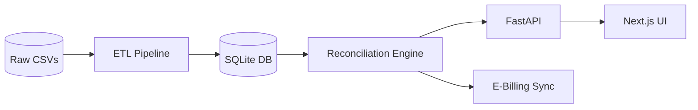

# 🚛 KPC Revenue Assurance Platform

> **Order-to-Cash Reconciliation Engine** – Inuka Hackathon 2026  

> *Solving revenue leakage*

[Python](https://python.org)](https://img.shields.io/badge/Python-3.11+-3776AB?logo=python)]([https://python.org](https://python.org)))

[FastAPI](https://fastapi.tiangolo.com)](https://img.shields.io/badge/FastAPI-0.115-009688?logo=fastapi)]([https://fastapi.tiangolo.com](https://fastapi.tiangolo.com)))

[Docker](https://docker.com)](https://img.shields.io/badge/Docker-Ready-2496ED?logo=docker)]([https://docker.com](https://docker.com)))

[Tests](#)](https://img.shields.io/badge/Tests-20%2F20%20Passing-brightgreen)](#))

---


## 🔍 Overview

KPC loses billions of shillings due to revenue leakage in its Order-to-Cash cycle:

- **Missing Invoices** – Fuel dispatched, no bill sent.
- **Missing Payments** – Bills sent, never paid.
- **Underpayments** – Paid less than invoiced.

**Our solution** reconciles Dispatches → Invoices → Payments, detects these leaks, and exposes everything via a REST API with automatic Swagger/OpenAPI docs.

---


## 🏗️ Architecture




---


## 🛠️ Tech Stack

| Backend | Database | Frontend |

| :--- | :--- | :--- |

| FastAPI + Uvicorn | SQLite (Dev) / PostgreSQL (Prod) | Next.js 14 |

| Pandas + NumPy | SQLAlchemy | Tailwind CSS |

| Pytest (20 tests) | Faker (Data Gen) | Recharts |

---


## 📚 API Documentation

**FastAPI auto-generates Swagger UI – Python's equivalent to Spring Boot's** `springdoc`**!**

| Feature | URL |

| :--- | :--- |

| 📖 **Swagger UI** (Interactive) | `http://localhost:8000/docs` |

| 📖 **ReDoc** (Clean Docs) | `http://localhost:8000/redoc` |

| 📄 **OpenAPI Schema** (TypeScript generator) | `http://localhost:8000/openapi.json` |

### Endpoints

| Method | Endpoint | Description |

| :--- | :--- | :--- |

| `POST` | `/api/reconcile` | Run reconciliation – returns metrics + anomalies + data quality |

| `POST` | `/api/reconcile/sync` | Sync pending anomalies to E-Billing (KRA iCMS sim) |

| `POST` | `/api/reconcile/update` | Manually resolve/review an anomaly |

| `GET` | `/api/e-billing/status` | E-Billing connection health |

| `GET` | `/` | Health check |

---


## 🖥️ Frontend Consumption (How to Call the API)


### 1. API Client Setup

```typescript

// frontend/src/lib/api-client.ts

import axios from 'axios';

const API_BASE = [process.env.NEXT](http://process.env.NEXT)_PUBLIC_API_URL || '[http://localhost:8000/api](http://localhost:8000/api)';

export const api = axios.create({ baseURL: API_BASE });

export const fetchReconciliation = async () => {

  const res = await [api.post](http://api.post)('/reconcile');

  return [res.data](http://res.data);

};

export const syncToEBilling = async () => {

  const res = await [api.post](http://api.post)('/reconcile/sync');

  return [res.data](http://res.data);

};

```


### 2. Dashboard Data Fetch

```tsx

// frontend/src/app/page.tsx

'use client';

import { useEffect, useState } from 'react';

import { fetchReconciliation } from '@/lib/api-client';

export default function Dashboard() {

  const [metrics, setMetrics] = useState(null);

  useEffect(() => {

    fetchReconciliation().then(data => setMetrics([data.data](http://data.data).metrics));

  }, []);

  return (

    <div className="grid grid-cols-4 gap-4">

      <Card title="Total Leakage" value={metrics?.total_leakage_kes} />

      <Card title="Recon Rate" value={metrics?.reconciliation_rate + '%'} />

      <Card title="Anomalies" value={metrics?.anomaly_count} />

      <Card title="Critical" value={metrics?.critical_count} />

    </div>

  );

}

```


### 3. TypeScript Types (Auto-Generated)

```bash

npx @openapitools/openapi-generator-cli generate \

  -i [http://localhost:8000/openapi.json](http://localhost:8000/openapi.json) \

  -g typescript-axios \

  -o ./src/generated

```

---


## 🧪 Endpoint Testing (Python vs Spring Boot)

| Spring Boot | FastAPI (Python) |

| :--- | :--- |

| `@SpringBootTest` + `MockMvc` | `pytest` + `TestClient` |

| `mockMvc.perform(get("/api/..."))` | `client.get("/api/...")` |

| `andExpect(status().isOk())` | `assert response.status_code == 200` |

### Example Test

```python

# tests/test_[api.py](http://api.py)

from fastapi.testclient import TestClient

from app.main import app

client = TestClient(app)

def test_reconcile():

    response = [client.post](http://client.post)("/api/reconcile")

    assert response.status_code == 200

    assert "metrics" in response.json()["data"]

```

**Run tests:**

```bash

pytest tests/ -v   # 20/20 passing

```

---


## 🚀 Quick Start


### With Docker (Recommended)

```bash

git clone [https://github.com/TristanBrian/kpc-revenue-assurance.git](https://github.com/yourteam/kpc-revenue-assurance.git)

cd kpc-revenue-assurance

docker compose up --build

# Backend: [http://localhost:8000](http://localhost:8000)

# Swagger: [http://localhost:8000/docs](http://localhost:8000/docs)

```


### Local Development

```bash

cd backend

python -m venv venv

source venv/bin/activate

pip install -r requirements.txt

python scripts/generate_kpc_[data.py](http://data.py)

python scripts/etl_[pipeline.py](http://pipeline.py)

uvicorn app.main:app --reload --host 0.0.0.0 --port 8000

```

---


## 📂 Project Structure

```

backend/

├── app/

│   ├── [main.py](http://main.py)          # FastAPI + Swagger

│   ├── routes/          # API endpoints

│   ├── services/        # Reconciliation logic

│   └── models/          # Pydantic schemas

├── data/                # CSVs + SQLite DB

├── scripts/             # Data generator + ETL

├── tests/               # 20 pytest cases

├── requirements.txt

└── Dockerfile

frontend/                # Next.js

```

---


## ✅ Test Suite

```bash

docker compose exec backend pytest tests/ -v

```

```text

✅ 20/20 passed in 1.5s

✅ 100% core logic coverage

✅ Data Quality: 5/5

✅ Reconciliation: 10/10

✅ E-Billing: 2/2

```

---


## 📊 Sample API Response

```json

{

  "metrics": {

    "total_dispatched_kes": 150,932,276,

    "total_leakage_kes": 22,173,205,

    "reconciliation_rate": 85.31,

    "anomaly_count": 296,

    "critical_count": 272,

    "pending_count": 13

  },

  "data_quality": { "quality_score": 96.5 },

  "performance": { "processing_time_seconds": 0.42 }

}

```

---


## 🚀 Deployment

- **Backend:** Railway / Render (Docker)
- **Frontend:** Vercel

```bash

# Set CORS origins in [main.py](http://main.py)

allow_origins = ["[https://your-frontend.vercel.app](https://your-frontend.vercel.app)"]

```

---


## 👥 Team

| Role | Person |

| :--- | :--- |

| Backend Core & API | Person A |

| Reconciliation Logic | Person B |

| Data Engineering & ETL | Person C |

| Frontend Lead | Person D |

| Frontend Visuals | Person E |

---

 **Built with ❤️ by Team Null Terminators – Closing the gap between fuel and cash. 🚛💰**