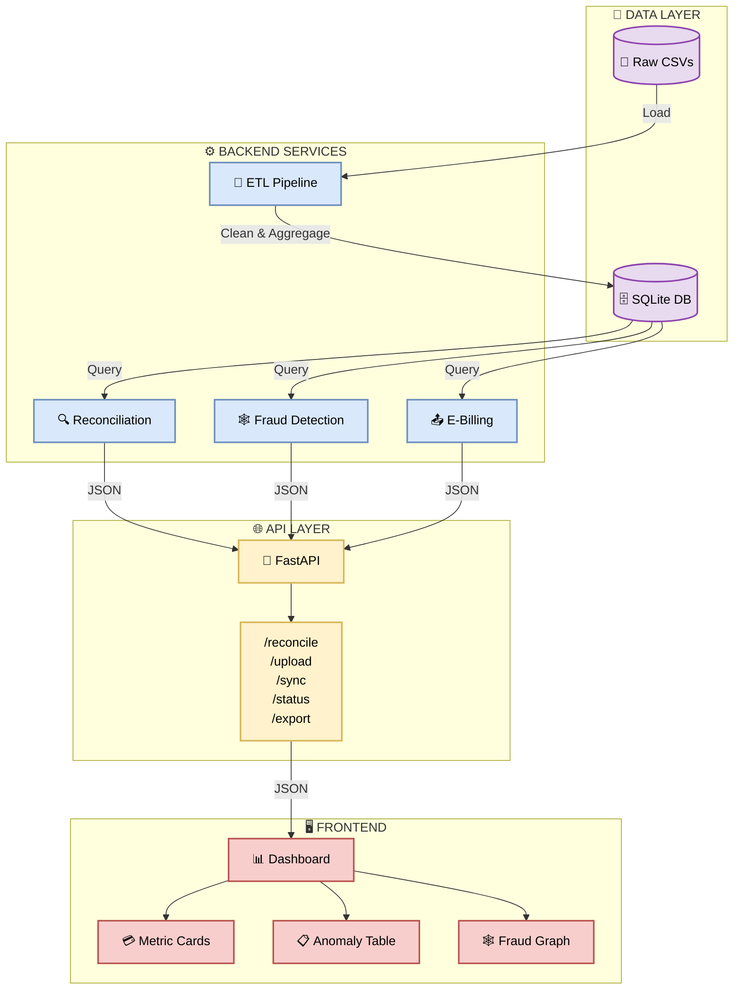

# 🚛 KPC Revenue Assurance Platform

>  **Reconciliation Engine for Kenya Pipeline Company**  

> *Solving Order-to-Cash Leakage problem & E-Billing Integration*

---

## 📖 Overview

KPC loses billions of shillings due to revenue leakage in its Order-to-Cash cycle:

- **Missing Invoices** – Fuel dispatched, no bill sent.
- **Missing Payments** – Bills sent, never paid.
- **Underpayments** – Paid less than invoiced.

**Our solution** reconciles Dispatches → Invoices → Payments, detects these leaks, and exposes everything via a REST API with automatic Swagger/OpenAPI docs.

---

## 🏗️ Architecture




---


## 🛠️ Tech Stack

| Layer | Technology |

| :--- | :--- |

| **Backend** | Python 3.11, FastAPI, Uvicorn |

| **Data Processing** | Pandas, NumPy, SQLAlchemy |

| **Fraud Detection** | NetworkX |

| **Database** | SQLite (Dev) / PostgreSQL (Prod) |

| **Testing** | Pytest (20+ tests) |

| **Deployment** | Docker, Docker Compose |

---


## 🚀 Quick Start


### Prerequisites

- Docker & Docker Compose
- OR Python 3.11+ (Local development)


### With Docker (Recommended)

```bash

# Clone the repo

git clone [https://github.com/TristanBrian/revenue-assurance.git](https://github.com/TristanBrian/revenue-assurance.git)

cd revenue-assurance

# Start the entire stack

docker compose up --build

# Backend: [http://localhost:8000](http://localhost:8000)

# Swagger Docs: [http://localhost:8000/docs](http://localhost:8000/docs)

```


### Local Development

```bash

# Backend

cd backend

python -m venv venv

source venv/bin/activate  # Windows: venv\Scripts\activate

pip install -r requirements.txt

# Generate data

python scripts/generate_kpc_[data.py](http://data.py)

# Run ETL

python scripts/etl_[pipeline.py](http://pipeline.py)

# Start server

uvicorn app.main:app --reload --host 0.0.0.0 --port 8000

```

---


## 📚 API Endpoints (Frontend Team)

| Method | Endpoint | Description |

| :--- | :--- | :--- |

| `POST` | `/api/reconcile` | Run reconciliation – returns metrics + anomalies |

| `POST` | `/api/reconcile/upload` | Upload custom CSVs |

| `POST` | `/api/reconcile/sync` | Sync anomalies to E-Billing |

| `POST` | `/api/reconcile/update` | Resolve/update an anomaly |

| `GET` | `/api/reconcile/export` | Download Excel report |

| `GET` | `/api/reconcile/template/{type}` | Download CSV template |

| `GET` | `/api/e-billing/status` | E-Billing integration status |

| `POST` | `/api/e-billing/sync` | Sync invoices to KRA iCMS |

| `POST` | `/api/e-billing/retry/{id}` | Retry failed sync |

| `GET` | `/api/e-billing/logs` | View sync audit logs |

**Swagger Docs:** [http://localhost:8000/docs](http://localhost:8000/docs)

---


## 📂 Project Structure (Team Roles)

```

kpc-revenue-assurance/

│

├── backend/                          # 🟢 Person A, B, C

│   ├── app/

│   │   ├── [main.py](http://main.py)                   # 🟢 Person A – FastAPI entry

│   │   ├── routes/                   # 🟢 Person A – API endpoints

│   │   │   ├── [reconcile.py](http://reconcile.py)          # Reconciliation routes

│   │   │   └── e_[billing.py](http://billing.py)          # E-Billing routes

│   │   ├── services/                 # 🔵 Person B – Business logic

│   │   │   ├── [reconciliation.py](http://reconciliation.py)     # 3-way match engine

│   │   │   └── e_[billing.py](http://billing.py)          # KRA iCMS simulation

│   │   ├── models/                   # 🟢 Person A – Pydantic schemas

│   │   └── utils/                    # 🟡 Person C – Helpers

│   │

│   ├── scripts/                      # 🟡 Person C – Data + ETL

│   │   ├── generate_kpc_[data.py](http://data.py)

│   │   └── etl_[pipeline.py](http://pipeline.py)

│   │

│   ├── data/                         # 🟡 Person C – CSVs (gitignored)

│   ├── tests/                        # 🔵 Person B – 20 tests

│   └── requirements.txt

│

├── frontend/                         # 🟣 Person D & 🟠 Person E

│   ├── src/

│   │   ├── app/                      # 🟣 Person D – Pages

│   │   ├── components/               # 🟠 Person E – UI

│   │   └── lib/                      # 🟣 Person D – API client

│   └── package.json

│

├── docker-compose.yml                # 🟢 Person A

└── [README.md](http://README.md)                         # Everyone

```

---


## 👥 Team Role Breakdown

| Role | Person | What You Own |

| :--- | :--- | :--- |

| **Backend Core & API** | 🟢 Person A | `main.py`, `routes/`, `models/`, 

| **Business Logic** | 🔵 Person B | `services/reconciliation.py`, `tests/` 

| **Data Engineering** | 🟡 Person C | `scripts/`, `data/`, `utils/`, ETL |

| **Frontend Lead** | 🟣 Person D | `app/`, `lib/`, API client, layout |

| **Frontend Visuals** | 🟠 Person E | `components/`, charts, graph |

---


## 🧪 Testing

```bash

# Run all tests

docker compose exec backend pytest tests/ -v

# Expected: 20/20 passing

```

---


## 📊 Sample Response

```json

{

  "metrics": {

    "total_dispatched_kes": 150932276,

    "total_leakage_kes": 22173205,

    "reconciliation_rate": 85.31,

    "anomaly_count": 296,

    "critical_count": 272

  },

  "anomalies": [...],

  "omc_risk_profile": [...]

}

```

---


## 🏆 Key Metrics

| Metric | Value |

| :--- | :--- |

| **Leakage Detected** | KSh 22.17M |

| **Reconciliation Rate** | 85.31% |

| **Anomalies Found** | 296 |

| **Data Quality Score** | 100% |

| **Tests Passing** | 20/20 |

| **Processing Time** | < 1s |

---


## 📝 Environment Variables

Create a `.env` file in the root:

```env

API_HOST=0.0.0.0

API_PORT=8000

CORS_ORIGINS=[http://localhost:3000](http://localhost:3000)

MATERIALITY_THRESHOLD=100000

```

---


## 🔗 Links

- **Swagger Docs:** [http://localhost:8000/docs](http://localhost:8000/docs)
- **ReDoc:** [http://localhost:8000/redoc](http://localhost:8000/redoc)
- **OpenAPI JSON:** [http://localhost:8000/openapi.json](http://localhost:8000/openapi.json)

---


## 📜 License

MIT – Built for the Inuka Hackathon 2026.

---

**Built with ❤️ by Null Terminators – Closing the gap between fuel and cash. 🚛💰**