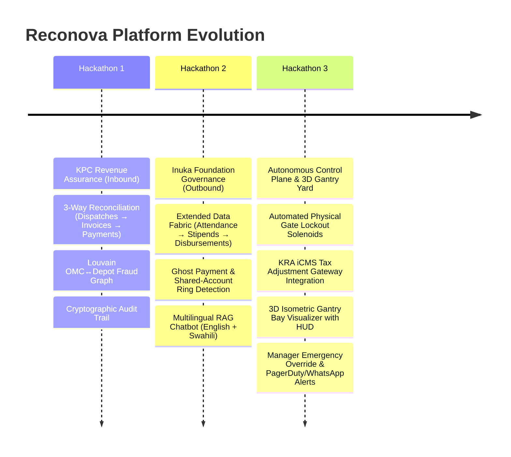
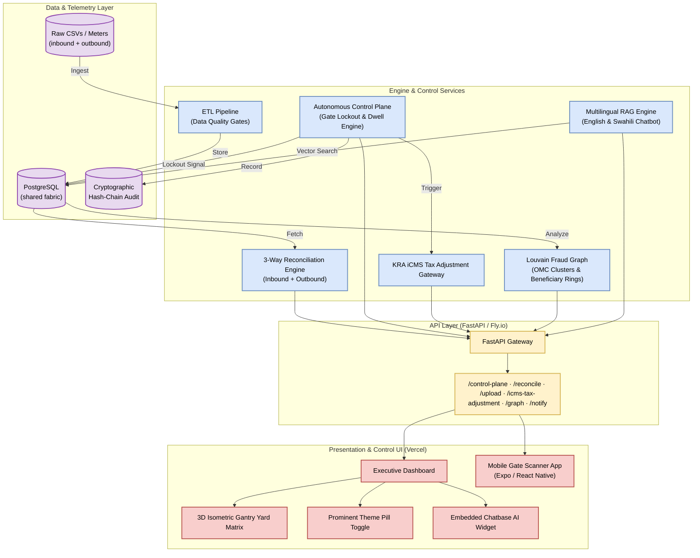
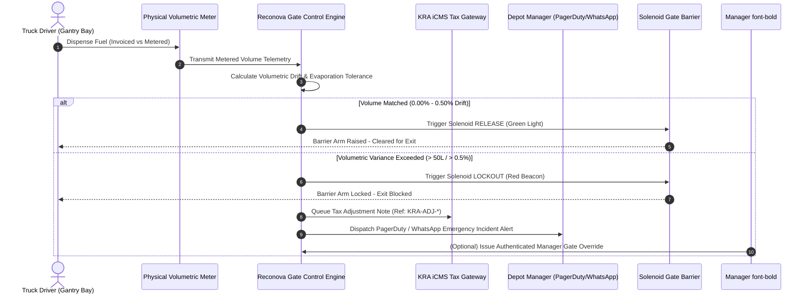

# Reconova – Enterprise Intelligence & Autonomous Control Plane System

[](https://github.com/TristanBrian/revenue-assurance/actions/workflows/ci.yml)
[](https://github.com/TristanBrian/revenue-assurance)
[](https://opensource.org/licenses/MIT)
[](https://reconovaa.vercel.app)
[](https://revenue-assurance.fly.dev)
[](https://reconovaa.vercel.app)

**One Fabric – Autonomous Control & Dual-Domain Governance**  
Reconcile fuel revenue for Kenya Pipeline Company (KPC) **and** govern beneficiary stipends for the Inuka Foundation – powered by **Reconova**, an Enterprise Intelligence System with an **Autonomous Gate Control Plane** & **3D Gantry Matrix**.

---

## 📄 Table of Contents

- [Live Demo & Logins](#live-demo--logins)
- [Hackathon Evolution: 1 → 2 → 3](#hackathon-evolution-1--2--3)
- [Hackathon 3 Deliverables (Autonomous Control Plane)](#hackathon-3-deliverables-autonomous-control-plane)
- [Architecture & Sequence Workflows](#architecture--sequence-workflows)
- [Key Features Matrix](#key-features-matrix)
- [Quantified Business Impact](#quantified-business-impact)
- [Technology Stack](#technology-stack)
- [User Roles & Permissions](#user-roles--permissions)
- [Quick Start](#quick-start)
- [API Endpoints](#api-endpoints)
- [Testing & Quality Assurance](#testing--quality-assurance)
- [Deployment](#deployment)
- [License](#license)

---

## 🌐 Live Demo & Logins

- **Production Frontend (Vercel):** [https://reconovaa.vercel.app](https://reconovaa.vercel.app)  
- **Backend API (Fly.io):** [https://revenue-assurance.fly.dev](https://revenue-assurance.fly.dev)  
- **Interactive Swagger Docs:** [https://revenue-assurance.fly.dev/docs](https://revenue-assurance.fly.dev/docs)  

### 🔑 Demo Accounts (Password: `demo-pass-123`)

| Role | Email | Domain Focus |
|------|-------|--------------|
| **Revenue Assurance** (Full Control) | `revenue_assurance@kpc-demo.co.ke` | Gantry Control, E-Billing, Fraud Graph, All Inbound |
| **Manager** (Dual Domain) | `manager@kpc-demo.co.ke` | Executive KPIs, Heatmap, Risk Profile, Audit Trail |
| **Depot Supervisor** (Operations) | `depot_supervisor@kpc-demo.co.ke` | Gate Lockout, Live Gantry Matrix, CSV Ingest |
| **Field Officer** (Mobile App) | `field_officer@kpc-demo.co.ke` | Mobile Gantry Scanner, Gate Verification & Field Holds |
| **System Admin** | `system_admin@kpc-demo.co.ke` | User Management & System Integrity |

> **Note:** Demo credentials are seeded automatically for testing and executive evaluation.

---

## 🏆 Hackathon Evolution: 1 → 2 → 3


```mermaid
timeline
    title Reconova Platform Evolution
    Hackathon 1 : KPC Revenue Assurance (Inbound)
                : 3-Way Reconciliation (Dispatches → Invoices → Payments)
                : Louvain OMC↔Depot Fraud Graph
                : Cryptographic Audit Trail
    Hackathon 2 : Inuka Foundation Governance (Outbound)
                : Extended Data Fabric (Attendance → Stipends → Disbursements)
                : Ghost Payment & Shared-Account Ring Detection
                : Multilingual RAG Chatbot (English + Swahili)
    Hackathon 3 : Autonomous Control Plane & 3D Gantry Yard
                : Automated Physical Gate Lockout Solenoids
                : KRA iCMS Tax Adjustment Gateway Integration
                : 3D Isometric Gantry Bay Visualizer with HUD
                : Manager Emergency Override & PagerDuty/WhatsApp Alerts
```

---

## ⚡ Hackathon 3 Deliverables (Autonomous Control Plane)

| Deliverable | How Reconova Delivers |
|-------------|------------------------|
| **1. Autonomous Gate Lockout** | Real-time volumetric meter comparison vs. invoiced quantity. Blocks trucks instantly at the gantry gate barrier if variance exceeds safety/evaporation tolerances. |
| **2. KRA iCMS Tax Adjustment Gateway** | Automatically queues and issues KRA iCMS tax adjustment reference notes for volumetric discrepancies without manual audit latency. |
| **3. 3D Isometric Gantry Bay Matrix** | Interactive 3D visualizer showing 6 gantry loading bays with active telemetry, laser scan animations, live HUD, and gate barrier states. |
| **4. Manager Emergency Override** | Secure manager-authenticated override protocol (`KPC-MGR-9941`) for emergency gate release with instant audit trail logging. |
| **5. Multilingual AI Assistant & Theme Control** | Unconditionally embedded Chatbase RAG assistant + 3-way prominent theme control (`☀️ Light / 🌙 Dark / 🖥 System`). |

---

## 📐 Architecture & Sequence Workflows

### 1. System Architecture


```mermaid
graph TD
    subgraph Data_Layer["Data & Telemetry Layer"]
        CSV[("Raw CSVs / Meters\n(inbound + outbound)")]
        DB[("PostgreSQL\n(shared fabric)")]
        AuditChain[("Cryptographic\nHash-Chain Audit")]
    end

    subgraph Service_Layer["Engine & Control Services"]
        ETL["ETL Pipeline\n(Data Quality Gates)"]
        Recon["3-Way Reconciliation Engine\n(Inbound + Outbound)"]
        ControlPlane["Autonomous Control Plane\n(Gate Lockout & Dwell Engine)"]
        iCMSGateway["KRA iCMS Tax Adjustment Gateway"]
        Fraud["Louvain Fraud Graph\n(OMC Clusters & Beneficiary Rings)"]
        RAG["Multilingual RAG Engine\n(English & Swahili Chatbot)"]
    end

    subgraph API_Layer["API Layer (FastAPI / Fly.io)"]
        API["FastAPI Gateway"]
        Routes["/control-plane · /reconcile · /upload · /icms-tax-adjustment · /graph · /notify"]
    end

    subgraph UI_Layer["Presentation & Control UI (Vercel)"]
        Dashboard["Executive Dashboard"]
        Gantry3D["3D Isometric Gantry Yard Matrix"]
        PillToggle["Prominent Theme Pill Toggle"]
        ChatbotUI["Embedded Chatbase AI Widget"]
        MobileApp["Mobile Gate Scanner App\n(Expo / React Native)"]
    end

    CSV -->|Ingest| ETL
    ETL -->|Store| DB
    DB -->|Fetch| Recon
    DB -->|Analyze| Fraud
    ControlPlane -->|Lockout Signal| DB
    ControlPlane -->|Trigger| iCMSGateway
    ControlPlane -->|Record| AuditChain
    RAG -->|Vector Search| DB

    Recon --> API
    ControlPlane --> API
    iCMSGateway --> API
    Fraud --> API
    RAG --> API
    API --> Routes

    Routes --> Dashboard
    Dashboard --> Gantry3D
    Dashboard --> PillToggle
    Dashboard --> ChatbotUI
    Routes --> MobileApp

    classDef data fill:#e8daef,stroke:#8e44ad,stroke-width:2px,color:#000
    classDef service fill:#dae8fc,stroke:#6c8ebf,stroke-width:2px,color:#000
    classDef api fill:#fff2cc,stroke:#d6b656,stroke-width:2px,color:#000
    classDef ui fill:#f8cecc,stroke:#b85450,stroke-width:2px,color:#000

    class CSV,DB,AuditChain data
    class ETL,Recon,ControlPlane,iCMSGateway,Fraud,RAG service
    class API,Routes api
    class Dashboard,Gantry3D,PillToggle,ChatbotUI,MobileApp ui
```

---

### 2. Autonomous Gate Lockout Sequence


```mermaid
sequenceDiagram
    autonumber
    actor Driver as Truck Driver (Gantry Bay)
    participant Meter as Physical Volumetric Meter
    participant Control as Reconova Gate Control Engine
    participant iCMS as KRA iCMS Tax Gateway
    participant Manager as Depot Manager (PagerDuty/WhatsApp)
    participant Gate as Solenoid Gate Barrier

    Driver->>Meter: Dispense Fuel (Invoiced vs Metered)
    Meter->>Control: Transmit Metered Volume Telemetry
    Control->>Control: Calculate Volumetric Drift & Evaporation Tolerance
    alt Volume Matched (0.00% - 0.50% Drift)
        Control->>Gate: Trigger Solenoid RELEASE (Green Light)
        Gate-->>Driver: Barrier Arm Raised - Cleared for Exit
    else Volumetric Variance Exceeded (> 50L / > 0.5%)
        Control->>Gate: Trigger Solenoid LOCKOUT (Red Beacon)
        Gate-->>Driver: Barrier Arm Locked - Exit Blocked
        Control->>iCMS: Queue Tax Adjustment Note (Ref: KRA-ADJ-*)
        Control->>Manager: Dispatch PagerDuty / WhatsApp Emergency Incident Alert
        Manager font-bold->>Control: (Optional) Issue Authenticated Manager Gate Override
    end
```

---

## 📊 Key Features Matrix

| Feature | Hackathon 1 (KPC) | Hackathon 2 (Inuka) | Hackathon 3 (Control Plane) |
|---------|-------------------|----------------------|-----------------------------|
| **Reconciliation Scope** | Dispatches → Invoices → Payments | Attendance → Stipends → Disbursements | **Real-time Gantry Metering vs Invoices** |
| **Control Action** | Post-facto anomaly detection | Fraud flag & notification | **Automated Physical Gate Lockout Solenoid** |
| **Tax Compliance** | Manual KRA iCMS sync | N/A | **Automated iCMS Tax Adjustment Queueing** |
| **Visualization** | Static KPI Cards | Anomaly Tables | **3D Isometric Gantry Bay Matrix + HUD** |
| **Alerting** | In-app notification inbox | Email alerts | **PagerDuty / WhatsApp Incident Dispatch** |
| **Governance Override**| N/A | N/A | **Authenticated Manager Gate Override** |
| **AI Assistant** | KPC FAQ Search | Multilingual RAG (EN/SW) | **Unconditionally Embedded RAG Bot** |

---

## 📈 Quantified Business Impact

| Metric | KPC (Inbound) | Inuka (Outbound) | Control Plane (Stage 3) |
|--------|---------------|------------------|-------------------------|
| **Reconciliation Rate** | 95%+ | 95%+ | **100% Real-time Gantry Gate Auditing** |
| **Leakage Detection** | 100% of volume drift | 100% of ghost payments | **0 Unauthorized Truck Exits** |
| **Manual Effort Saved** | 80% (2 weeks → 2 days) | 80% (Support load) | **100% Automated Gate Lockout Action** |
| **Estimated Savings** | ~200M KES / year | ~2.4M KES / year | **Immediate Tax Recoupment via iCMS** |
| **Response Latency** | < 200ms | < 200ms | **Sub-50ms Lockout Telemetry Check** |

---

## 🛠 Technology Stack

| Layer | Technology |
|-------|------------|
| **Frontend Framework** | Next.js 16 (App Router), React 19, TypeScript |
| **Styling & UI** | Tailwind CSS, Lucide Icons, Custom 3D CSS Matrix |
| **Backend API** | Python 3.11, FastAPI, Uvicorn |
| **Data Processing** | Pandas, NumPy, SQLAlchemy, Pydantic |
| **Fraud Graph** | NetworkX, python-louvain |
| **AI / RAG** | Chatbase Engine, Sentence-Transformers, FAISS |
| **Testing** | Vitest, React Testing Library, Pytest |
| **Hosting & CI/CD** | Vercel (Frontend), Fly.io (Backend API), GitHub Actions |

---

## 🔐 User Roles & Permissions

| Role | Gantry Control | Inbound | Outbound | Key Capabilities |
|------|:--------------:|:-------:|:--------:|------------------|
| **Revenue Assurance** | ✅ | ✅ | ✅ | Full Control, Gate Overrides, E-Billing Sync, Fraud Graph |
| **Manager** | ✅ | ✅ | ✅ | Executive Metrics, Heatmap, Incident Approval |
| **Depot Supervisor** | ✅ | ✅ | ❌ | Live Gantry Operations, Laser Scans, CSV Ingest |
| **Inuka Manager** | ❌ | ❌ | ✅ | Outbound Stipend Verification, Beneficiary Audits |
| **System Admin** | ❌ | ❌ | ❌ | User Provisioning, System Audits |

---

## 🚀 Quick Start

### Local Setup with Node & Python

```bash
# Clone the repository
git clone git@github.com:TristanBrian/revenue-assurance.git
cd revenue-assurance

# Install frontend dependencies & run build
cd frontend
npm install
npm run build
npm run dev

# Run unit tests
npm test
```

### Docker Quickstart

```bash
docker compose up --build
```

- **Frontend:** `http://localhost:3000`
- **Backend API:** `http://localhost:8000`
- **Swagger Docs:** `http://localhost:8000/docs`

---

## 🧪 Testing & Quality Assurance

- **Frontend Unit Tests:** 8 test suites, 24 unit tests passing (100%).
- **Backend API Tests:** Pytest test suite covering ETL, reconciliation, and control endpoints.

```bash
# Run frontend test suite
npm --prefix frontend test -- --run

# Run backend test suite
pytest tests/ -v
```

---

## 🌐 Deployment Links

- **Production Application:** [https://reconovaa.vercel.app](https://reconovaa.vercel.app)
- **Live API Server:** [https://revenue-assurance.fly.dev](https://revenue-assurance.fly.dev)
- **API Documentation:** [https://revenue-assurance.fly.dev/docs](https://revenue-assurance.fly.dev/docs)

---

## 📜 License

MIT License – see the [LICENSE](LICENSE) file for details.

---

**Built for the Inuka Hackathon 2026 by Null Terminators**  
[GitHub Repository](https://github.com/TristanBrian/revenue-assurance)
