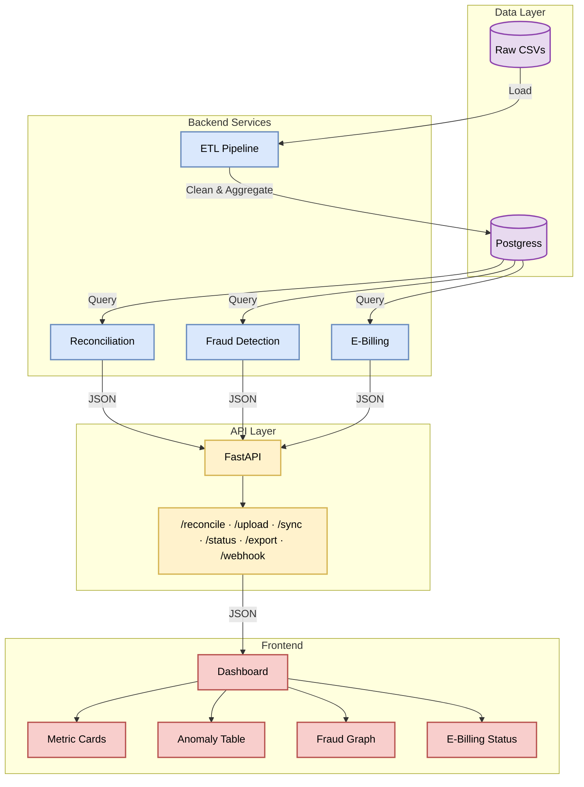

# KPC Revenue Assurance Platform

**Reconciliation engine for Kenya Pipeline Company**
Detects Order-to-Cash leakage and integrates with KRA's e-billing (iCMS) system.

## Overview

The platform reconciles two parallel money-flow domains through the same engine, distinguished by a `flow_direction` discriminator rather than two separate stacks:

- **Inbound** — KPC fuel revenue. Dispatches → Invoices → Payments (OMCs paying KPC).
- **Outbound** — Inuka Foundation beneficiary stipends. Attendance → Stipend Authorizations → Disbursements (KPC/Inuka paying beneficiaries).

KPC loses revenue in its Order-to-Cash cycle through:

- **Missing invoices** — fuel dispatched, no bill sent
- **Missing payments** — bills sent, never paid
- **Underpayments** — paid less than invoiced

Inuka Foundation's stipend program leaks money through the mirror-image breaks — missing authorizations, missing disbursements, underpayments — plus three outbound-specific, always-critical fraud signals: overpayment, duplicate disbursement, and ghost payment (a disbursement with no backing authorization at all). See [Outbound (Stipend/Disbursement) Reconciliation](#outbound-stipenddisbursement-reconciliation) for the full domain mapping and severity rules.

This platform reconciles both three-way chains, flags these breaks, and exposes the results via a REST API (with Swagger/OpenAPI docs) — every reconciliation/heatmap/fraud-graph/export endpoint accepts a `?direction=inbound|outbound|all` filter rather than duplicating endpoints per direction. It also includes a simulated E-Billing integration with KRA iCMS: retry logic, a dead letter queue, webhook callbacks, and failure-rate monitoring (inbound-only — outbound disbursements have no e-billing/KRA concept).

## Architecture


```mermaid
graph TD
    subgraph Data_Layer["Data Layer"]
        CSV[("Raw CSVs")]
        DB[("Postgress")]
    end

    subgraph Service_Layer["Backend Services"]
        ETL["ETL Pipeline"]
        Recon["Reconciliation"]
        Fraud["Fraud Detection"]
        EBill["E-Billing"]
    end

    subgraph API_Layer["API Layer"]
        API["FastAPI"]
        Routes["/reconcile · /upload · /sync · /status · /export · /webhook"]
    end

    subgraph UI_Layer["Frontend"]
        Dashboard["Dashboard"]
        Cards["Metric Cards"]
        Table["Anomaly Table"]
        Graph["Fraud Graph"]
        EBillUI["E-Billing Status"]
    end

    CSV -->|Load| ETL
    ETL -->|Clean & Aggregate| DB
    DB -->|Query| Recon
    DB -->|Query| Fraud
    DB -->|Query| EBill

    Recon -->|JSON| API
    Fraud -->|JSON| API
    EBill -->|JSON| API
    API --> Routes

    Routes -->|JSON| Dashboard
    Dashboard --> Cards
    Dashboard --> Table
    Dashboard --> Graph
    Dashboard --> EBillUI

    classDef data fill:#e8daef,stroke:#8e44ad,stroke-width:2px,color:#000
    classDef service fill:#dae8fc,stroke:#6c8ebf,stroke-width:2px,color:#000
    classDef api fill:#fff2cc,stroke:#d6b656,stroke-width:2px,color:#000
    classDef ui fill:#f8cecc,stroke:#b85450,stroke-width:2px,color:#000

    class CSV,DB data
    class ETL,Recon,Fraud,EBill service
    class API,Routes api
    class Dashboard,Cards,Table,Graph,EBillUI ui
```


`Fraud` and the `Fraud Graph` UI: `GET /api/graph` builds an OMC↔depot leakage graph (inbound) and/or an Officer↔Beneficiary leakage graph (outbound) and runs Louvain community detection to surface correlated-leakage clusters — including a direct beneficiary↔beneficiary edge for shared disbursement accounts, so a payout ring clusters together even when its members report to different officers (see [Project Status](#project-status)).

This same `ETL`/`Recon`/`Fraud` service layer runs both directions — the boxes above aren't inbound-specific, they're parametrized by `flow_direction`. Nothing here is a duplicated stack: same `ETL Pipeline` (extra CSVs, same quality gates), same `Reconciliation` service (a second three-way-match function reusing every field name/shape the first one already returns), same `Fraud Detection` graph builder, same `API`/`Routes`/`Dashboard` — only the direction toggle and RBAC change what a given user sees.

## Key Features


| Feature                  | Description                                                                                                    |
| ------------------------ | -------------------------------------------------------------------------------------------------------------- |
| Three-way reconciliation | Matches Dispatches → Invoices → Payments to detect missing invoices, missing payments, and under/overpayments. |
| E-Billing integration    | Syncs invoices to KRA iCMS with retry logic (3 attempts, exponential backoff).                                 |
| Dead letter queue        | Failed invoices are stored for reprocessing rather than dropped.                                               |
| Webhook callback         | Simulates KRA's asynchronous confirmation of invoice processing.                                               |
| E-Billing dashboard      | Sync health: synced/pending/failed counts, reconciliation rate.                                                |
| Failure monitoring       | Alerts when the sync failure rate exceeds a configurable threshold.                                            |
| Materiality threshold    | Configurable filter to focus on significant leaks.                                                             |
| Duplicate detection      | Flags duplicate invoices/dispatches.                                                                           |
| OMC risk profiling       | Aggregates leakage per OMC and assigns a High/Medium/Low risk level.                                           |
| Data quality scoring     | 0-100% score based on nulls, zeros, and invalid customer references.                                           |
| CSV upload & templates   | Reconcile ad hoc CSVs without touching the database, or download templates for the expected format.            |
| Excel export             | Multi-sheet workbook report (summary, anomalies, data quality, risk profile) — splits into separate Inbound/Outbound anomaly tabs on `direction=all`. |
| Alerts & notifications   | In-app inbox + SMTP email, one module for both. System-triggered (new critical anomalies, e-billing failure-rate breaches) and manual broadcasts (`manage_alerts`). See [Alerts & Notifications](#alerts--notifications). |
| Outbound (stipend/disbursement) recon | Second three-way match (Attendance → Stipend Authorization → Disbursement) for Inuka Foundation beneficiary payouts, sharing the same engine, dashboard, and fraud graph as inbound via a `flow_direction` toggle. See [Outbound (Stipend/Disbursement) Reconciliation](#outbound-stipenddisbursement-reconciliation). |


## Tech Stack


| Layer                     | Technology                                            |
| ------------------------- | ----------------------------------------------------- |
| Backend                   | Python 3.11, FastAPI, Uvicorn                         |
| Data processing           | Pandas, NumPy, SQLAlchemy                             |
| Fraud detection (planned) | NetworkX, python-louvain                              |
| Database                  | SQLite (dev) / PostgreSQL (prod)                      |
| Testing                   | Pytest                                                |
| Frontend                  | Next.js (App Router), React, TypeScript, Tailwind CSS |
| Deployment                | Docker, Docker Compose                                |
| API docs                  | Swagger UI, ReDoc                                     |


## 👥 User Roles

Every API route except `POST /api/auth/login`, `POST /api/auth/register` (bootstrap-only), and `POST /api/e-billing/webhook` (an external KRA callback, not a user action) requires a JWT bearer token — obtain one via `POST /api/auth/login` with `{"email": ..., "password": ...}`. Roles and permissions are seeded with `python scripts/seed_roles.py`; the first `system_admin` account is bootstrapped separately with `python scripts/seed_admin.py` (see [Quick Start](#quick-start)).

| Role | Description | Key Features |
| :--- | :--- | :--- |
| **Depot Supervisor** | Operations Lead – manages daily depot activities. | Live Feed, Upload CSV & Templates, Executive Metrics — **inbound only**, direction toggle hidden |
| **Manager** | Strategic Decision Maker – oversees regional operations. | Live Feed, Heatmap, OMC Risk Profile, Executive Metrics, Anomaly Table, Export Reports, Audit Trail — both directions, free toggle |
| **Revenue Assurance** | Financial Analyst – investigates and resolves anomalies. | All Manager features + Upload CSV/Templates, Resolve/Review/Assign, E-Billing Sync, Fraud Graph, Risk Analytics, Audit Trail — both directions, free toggle |
| **Inuka Manager** | Inuka Foundation program lead – views (but never resolves) beneficiary stipend/disbursement anomalies. | Live Feed, Heatmap, Risk Profile, Executive Metrics, Anomaly Table, Export Reports, Fraud Graph — **outbound only**, direction toggle hidden, no `resolve_anomaly` |
| **System Admin** | Platform administrator. Scoped only to user management — no access to any revenue-assurance feature below. | Create/list/edit/delete users, assign roles |

Role names are matched loosely at registration/edit time rather than requiring an exact string: `"supervisor"`, `"depot"`, `"depo"` all map to `depot_supervisor`; `"inuka"`, `"inuka manager"` map to `inuka_manager` (checked *before* the plain-manager keywords below, so "inuka manager" doesn't get provisioned as plain Manager); `"man"`, `"manager"`, `"MANAGER"` map to `manager`; anything containing `"revenue"` or `"assurance"` maps to `revenue_assurance`.

### Admin-provisioned users & forced password reset

`POST /api/admin/users` (`manage_users`) is the normal way to create a user going forward — unlike `POST /api/auth/register`, it takes no password. The backend generates a random 12-character temp password, stores only its hash, sets `must_reset_password=True` with a 48h expiry, and emails the plaintext once via `app/core/email.py` (never persisted, never returned in the API response).

On that first login, `POST /api/auth/login` doesn't issue a normal session token — it returns `reset_required: true` and a separate, 15-minute, single-purpose `reset_token` scoped only to `POST /api/auth/reset-password`. That endpoint rejects a password identical to the temp one, and on success issues a normal session token and clears `must_reset_password`. The reset token self-invalidates once redeemed (or once an admin regenerates the temp password via `POST /api/admin/users/{id}/resend-temp-password`) — no server-side token blacklist needed, see `core/security.py`'s `password_fingerprint()`.

`get_current_user()` also rejects any request from a user with `must_reset_password` still set, even with an otherwise-valid session token — closing the gap where an admin forces a reset on an already-active user mid-session. The admin user list surfaces this as an `account_status` per user: `Invited / Pending first login`, `Reset Required`, or `Active`.

**Terms & Conditions / Privacy Policy consent is bundled into the same reset-password submission**, not a separate screen. `GET /api/auth/terms` serves the current versioned text (server-side, via a `terms_documents` table — see `scripts/seed_terms_documents.py` — so a version bump is a data change, not a frontend deploy). `POST /api/auth/reset-password` requires `checkbox_accepted: true` and a matching `confirm_password` alongside the new password, validated server-side before any mutation — a rejected submission leaves the account exactly as it was (no password set, no consent recorded). On success it also writes two `consent_records` rows (one per document type: `terms_and_conditions`, `privacy_policy`, each with the exact version/hash accepted, IP, and user agent) and updates `users.terms_accepted_version`/`terms_accepted_at`.

The same `get_current_user()` guard also blocks any user whose `terms_accepted_version` is stale (never accepted, or a newer version was published since) — even an already-active user with a valid session, mid-session, once a new version goes active. Since that user's password is fine, they get a lighter re-consent path instead: `POST /api/auth/login` returns `terms_required: true` with a `consent_token` (same self-invalidating, 15-minute, single-purpose shape as `reset_token`), which `POST /api/auth/accept-terms` redeems — no password fields, just the checkbox. Both flows share one `record_consent()` implementation (`app/services/terms_service.py`) and are logged to the audit trail as `consent.accepted`.

### Permission Mapping

| Feature | Permission code | Depot Supervisor | Manager | Revenue Assurance | Inuka Manager |
| :--- | :--- | :---: | :---: | :---: | :---: |
| Live Feed | `view_live_feed` | ✅ | ✅ | ✅ | ✅ |
| Upload CSV / Templates | `upload_csv` | ✅ | ❌ | ✅ | ❌ |
| Heatmap | `view_heatmap` | ❌ | ✅ | ✅ | ✅ |
| OMC/Beneficiary Risk Profile | `view_omc_risk_profile` | ❌ | ✅ | ✅ | ✅ |
| Executive Metrics | `view_metrics` | ✅ | ✅ | ✅ | ✅ |
| Anomaly Table | `view_anomaly_table` | ❌ | ✅ | ✅ | ✅ |
| Resolve/Review/Assign | `resolve_anomaly` | ❌ | ❌ | ✅ | ❌ |
| E-Billing Sync | `manage_ebilling` | ❌ | ❌ | ✅ | ❌ |
| Export Reports | `export_reports` | ❌ | ✅ | ✅ | ✅ |
| Fraud Graph (structural network) | `view_fraud_graph` | ❌ | ❌ | ✅ | ✅ |
| Risk Analytics (statistical/EDA) | `view_risk_analytics` | ❌ | ❌ | ✅ | ❌ |
| Audit Trail | `view_audit` | ❌ | ✅ | ✅ | ❌ |
| Broadcast Alerts | `manage_alerts` | ❌ | ✅ | ✅ | ❌ |
| Outbound (stipend) data | `view_outgoing_data` | ❌ | ✅ | ✅ | ✅ |

`manage_users` and `manage_permissions` gate user administration (`/api/admin/*`) and are held only by `system_admin` — not shown above since they're not a revenue-assurance feature.

`view_outgoing_data` gates access to `direction=outbound`/`all` on the reconcile/heatmap/fraud-graph/export endpoints — see [Outbound (Stipend/Disbursement) Reconciliation](#outbound-stipenddisbursement-reconciliation) for why it's a modifier permission rather than a full backend-side direction lock, and how the frontend's direction toggle enforces the inbound/outbound boundary in practice for Depot Supervisor and Inuka Manager.

Every role can read its own alert inbox (`GET /api/alerts`) regardless of `manage_alerts` — that permission only gates *creating* a manual broadcast, not *seeing* alerts addressed to you. See [Alerts & Notifications](#alerts--notifications).

## Alerts & Notifications

One module (`app/services/alert_service.py`), two channels (`app/models/alert.py` for the in-app inbox, `app/core/email.py` for SMTP) — every alert is always written in-app and optionally emailed, never one or the other from separate code paths.

**Registry-driven, not ad hoc:** `app/services/alert_types.py` is the single source of truth for every trigger — its tier (`immediate` / `digested` / `throttled` / `transactional`), severity, and audience. Audience is either `target_permissions` (resolves to whoever actually holds that route-access permission — e.g. `view_anomaly_table` naturally means Manager + Revenue Assurance) or `target_roles` (for pure platform-operational concerns like ETL failures or four-eyes admin visibility, where "system_admin" is the right audience because they operate the platform, not because of a feature permission). `create_alert()` takes an `AlertType` and pulls tier/audience from there, so routing policy lives in one file, not scattered per call site.

**System-triggered**, spanning reconciliation (new critical anomalies — digested; a single anomaly far exceeding materiality; an OMC escalating to High risk; a data-quality drop; a duplicate-record spike; a reopened anomaly; repeated resolve/reopen cycles; ETL failures), the fraud graph (a newly-detected high-risk cluster — digested), e-billing (an invoice entering the dead-letter queue; a failure-rate breach *and* its recovery — throttled hourly; a webhook failure), and auth/admin (a temp password expiring unused; four-eyes visibility to other admins on user create/delete/role-change; bulk exports; and a self-monitoring fallback alert when an alert's own email delivery genuinely fails). Several trigger types are deliberately unimplemented rather than faked — no job scheduler, login-lockout system, self-service password change, or quota-consumption logic exists yet to hook them into; each says why directly in the registry's `notes`.

**Manual:** `POST /api/alerts` (requires `manage_alerts`) broadcasts a one-off alert to any combination of permissions, roles, or a single user.

**Reading your inbox:** `GET /api/alerts` (own alerts, `unread_only` filter, paginated), `GET /api/alerts/unread-count` (badge count), `POST /api/alerts/{id}/read` / `POST /api/alerts/read-all`.

**Email setup:** optional — see `SMTP_*` in `.env.example`. Without SMTP configured, alerts still work in-app; email sending is skipped and logged, not an error (and — deliberately — not itself reported as a delivery failure, since nothing was actually attempted).

## Outbound (Stipend/Disbursement) Reconciliation

A second three-way match for Inuka Foundation's beneficiary stipend program, extending — not forking — the existing engine: same ETL, same reconciliation service, same fraud graph, same dashboard, same anomaly table/heatmap/export components. `flow_direction` (`"inbound"` / `"outbound"`) is a field on each anomaly, not a second database or a second app.

### Domain mapping

| Inbound (fuel revenue) | Outbound (stipends) |
| :--- | :--- |
| Dispatch | Attendance / Eligibility Record |
| Invoice | Stipend Authorization |
| Payment | Disbursement |
| OMC | Beneficiary |
| Product | Pillar (Scholarship / Plus / Vocational / Tech) |
| Depot | Field Officer / Program Site |

### Severity rules

Missing Authorization, Missing Disbursement, and Underpayment scale with materiality exactly like their inbound equivalents. Three break types are **critical by default regardless of amount**, exempt from the materiality filter entirely:

- **Overpayment** — paid more than authorized.
- **Duplicate Disbursement** — same beneficiary, same period, paid twice (reuses the existing `detect_duplicates()` logic).
- **Ghost Payment** — a disbursement with no matching authorization at all (`authorization_id` is null, or refers to an authorization that doesn't exist). This is also the fraud-ring signal `scripts/generate_kpc_data.py`'s `inject_disbursement_ring()` injects via several beneficiaries sharing one `disbursing_account` — surfaced as a direct beneficiary↔beneficiary edge in the fraud graph (see the Architecture section above) so the ring clusters into one Louvain community even when its members report to different field officers.

### Direction filtering

Every reconciliation/heatmap/fraud-graph/export endpoint accepts `?direction=inbound|outbound|all` (default `all`) rather than duplicating endpoints per direction — see [API Endpoints](#api-endpoints). The frontend exposes this as a 3-way "Flow Direction" toggle (Incoming / Outgoing / All) in the sidebar, hard-locked and hidden for roles that only ever see one side (Depot Supervisor → inbound, Inuka Manager → outbound) and freely switchable for Manager/Revenue Assurance.

### RBAC

`view_outgoing_data` gates outbound visibility (see [Permission Mapping](#permission-mapping)); the new **Inuka Manager** role holds every outbound view/export permission but never `resolve_anomaly` — outbound anomalies can be seen and exported, not resolved, by that role. The existing admin-provisioned-user flow (temp password, forced reset, Terms/Privacy consent) covers Inuka Manager with no special-casing — it's just another role in the same `role_name` field.

### What's intentionally not wired up (yet)

- `scripts/live_kpc_stream.py`'s continuous streaming simulation has an outbound event cycle understood but not enabled as a background service — deferred by design, not an oversight.
- The medallion (bronze/silver/gold) lakehouse tables (`setup_medallion.sql`/`.py`) don't yet have outbound-specific silver/gold views (e.g. a `gold.beneficiary_stipend_summary` mirroring `gold.omc_revenue_summary`) — the main app reads outbound data directly from the ETL-loaded tables, same as it does for inbound.
- A dedicated Pillar × Region heatmap view — the existing generic Beneficiary × Pillar pivot (reusing the same `customer`/`product` field names inbound uses) covers the acceptance bar for now.

## Quick Start


### Prerequisites

- Docker and Docker Compose, or
- Python 3.11+ and Node.js 20+ for local development


### Demo logins

Auth is real (JWT + RBAC, enforced on every route) — you need to log in. Both setup paths below seed the same five demo accounts automatically, so no one needs to ask a teammate for credentials:

| Role | Email | Password |
|---|---|---|
| Depot Supervisor | `depot_supervisor@kpc-demo.co.ke` | `Demo-Access-123!` |
| Manager | `manager@kpc-demo.co.ke` | `Demo-Access-123!` |
| Revenue Assurance | `revenue_assurance@kpc-demo.co.ke` | `Demo-Access-123!` |
| Inuka Manager | `inuka_manager@kpc-demo.co.ke` | `Demo-Access-123!` |
| System Admin | `system_admin@kpc-demo.co.ke` | `Demo-Access-123!` |

These are throwaway local-dev accounts seeded by `backend/scripts/seed_demo_users.py` — never point that script at a real deployment.

### With Docker

Fully self-contained — includes its own Postgres container, runs migrations and seeds the demo accounts above automatically. Nothing to configure first.

```bash
git clone git@github.com:TristanBrian/revenue-assurance.git
cd revenue-assurance
cp .env.example .env   # works as-is for local/demo use; regenerate SECRET_KEY (openssl rand -hex 32) for anything beyond that
docker compose up --build
```

Backend: [http://localhost:8000](http://localhost:8000) · Swagger docs: [http://localhost:8000/docs](http://localhost:8000/docs) · Frontend: [http://localhost:3000](http://localhost:3000)

### Local development

Auth requires PostgreSQL — `users`/`roles`/`permissions` use Postgres-native `UUID` columns, which SQLite has no type for. `backend/scripts/setup_local_postgres.sh` sets up a self-contained cluster with no sudo and no system Postgres config — safe to run even if you already have Postgres installed, since it uses its own port (5433) and doesn't touch anything else:

```bash
cd backend
python -m venv venv
source venv/bin/activate  # Windows: venv\Scripts\activate
pip install -r requirements.txt

./scripts/setup_local_postgres.sh     # prints the DATABASE_URL to put in your repo-root .env
# (edit .env, then continue)

python scripts/generate_kpc_data.py   # generate synthetic CSVs — both inbound (dispatches/invoices/payments/omcs) and outbound (officers/beneficiaries/attendance/stipend_authorizations/disbursements)
python scripts/etl_pipeline.py        # loads to SQLite always, and to Postgres too if DATABASE_URL is a postgresql:// URI

alembic upgrade head                  # creates users/roles/permissions/user_roles/role_permissions/alerts/consent tables
python scripts/seed_roles.py          # seeds the roles + permissions in the README's Permission Mapping table above, including inuka_manager
python scripts/seed_admin.py          # bootstraps the first system_admin (admin@yopmail.com / Admin-Access-123!) — required before /api/auth/register works, since that route is itself gated behind manage_users
python scripts/seed_demo_users.py     # seeds the 5 demo logins above
python scripts/seed_terms_documents.py  # seeds v1 Terms & Conditions / Privacy Policy — every user, including the demo logins above, must (re-)consent once this has run

uvicorn app.main:app --reload --host 0.0.0.0 --port 8000
```

Frontend:

```bash
cd frontend
npm install
cp .env.local.example .env.local
npm run dev
```

Frontend: [http://localhost:3000](http://localhost:3000) — redirects to `/login`, then to the role-appropriate dashboard.

## API Endpoints

Every row below except `/api/auth/login`, `/api/auth/register`, and `/api/e-billing/webhook` requires `Authorization: Bearer <token>` and is gated by the noted permission (see [Permission Mapping](#permission-mapping)).

| Method | Endpoint                          | Permission               | Description                                                  |
| ------ | ---------------------------------- | ------------------------- | -------------------------------------------------------------- |
| POST   | `/api/auth/login`                 | —                          | Log in with `{email, password}` — returns a JWT, or a scoped `reset_token`/`consent_token` if a reset/re-consent is required |
| POST   | `/api/auth/reset-password`        | —                           | Redeem a `reset_token`: set a new password + accept Terms/Privacy in one call |
| GET    | `/api/auth/terms`                 | —                           | Current Terms & Conditions / Privacy Policy text + required version |
| POST   | `/api/auth/accept-terms`          | —                           | Redeem a `consent_token` to re-accept a newer Terms/Privacy version (no password change) |
| POST   | `/api/auth/register`              | `manage_users`             | Create a user and assign a role (takes a password directly — see `POST /api/admin/users` for the no-password flow) |
| GET    | `/api/auth/me`                    | *(any authenticated)*      | Current user's profile, roles, permissions                     |
| GET    | `/api/feed`                       | `view_live_feed`           | Live anomaly feed                                               |
| POST   | `/api/reconcile/metrics`          | `view_metrics`             | Executive metrics (KPIs/summary, DB-backed). `?direction=inbound\|outbound\|all` (default `all`) |
| GET    | `/api/reconcile/anomalies`        | `view_anomaly_table`       | Paginated anomaly table (DB-backed). `?direction=inbound\|outbound\|all` |
| GET    | `/api/reconcile/omc-risk-profile` | `view_omc_risk_profile`    | OMC (inbound) / Beneficiary (outbound) risk profile (DB-backed). `?direction=inbound\|outbound\|all` |
| GET    | `/api/heatmap`                    | `view_heatmap`             | OMC × Product (inbound) / Beneficiary × Pillar (outbound) leakage heatmap. `?direction=inbound\|outbound\|all` |
| POST   | `/api/reconcile/upload`           | `upload_csv`                | Run reconciliation against uploaded CSVs — **inbound only** by design (dispatches/invoices/payments) |
| GET    | `/api/reconcile/template/{type}`  | `upload_csv`                | Download a CSV template                                         |
| POST   | `/api/reconcile/update`           | `resolve_anomaly`           | Resolve/update an anomaly                                       |
| GET    | `/api/reconcile/export`           | `export_reports`            | Download an Excel report. `?direction=inbound\|outbound\|all` — splits into separate Inbound/Outbound anomaly tabs on `all` |
| POST   | `/api/reconcile/sync`             | `manage_ebilling`           | Sync anomalies to E-Billing — **inbound only** (no e-billing/KRA concept for disbursements) |
| GET    | `/api/graph`                      | `view_fraud_graph`          | Anomaly-based fraud graph: OMC↔Depot (inbound) and/or Officer↔Beneficiary (outbound), Louvain community detection. `?direction=inbound\|outbound\|all` |
| GET    | `/api/graph/network`              | `view_fraud_graph`          | Structural OMC↔Depot network (raw dispatch data, not anomalies) — inbound only |
| GET    | `/api/graph/communities`          | `view_fraud_graph`          | Structural OMC risk communities — inbound only                  |
| GET    | `/api/graph/omc/{omc_id}`         | `view_fraud_graph`          | Per-OMC risk detail + community membership — inbound only       |
| GET    | `/api/e-billing/status`           | `manage_ebilling`           | E-Billing integration status                                    |
| POST   | `/api/e-billing/sync`             | `manage_ebilling`           | Sync invoices to KRA iCMS (synchronous)                         |
| POST   | `/api/e-billing/sync/async`       | `manage_ebilling`           | Trigger a non-blocking background sync (returns `task_id`)      |
| GET    | `/api/e-billing/task/{task_id}`   | `manage_ebilling`           | Poll async task progress and result                             |
| POST   | `/api/e-billing/retry/{id}`       | `manage_ebilling`           | Retry a failed sync                                              |
| GET    | `/api/e-billing/logs`             | `manage_ebilling`           | View sync audit logs                                             |
| GET    | `/api/e-billing/pending`          | `manage_ebilling`           | List pending invoices                                            |
| POST   | `/api/e-billing/webhook`          | —                           | Simulate a KRA webhook callback (external, no user auth)        |
| GET    | `/api/e-billing/reconcile`        | `manage_ebilling`           | E-Billing reconciliation dashboard                               |
| GET    | `/api/e-billing/monitor`          | `manage_ebilling`           | Failure rate monitoring                                          |
| GET    | `/api/admin/users`                | `manage_users`              | List all users, with `account_status` (Invited / Reset Required / Active) |
| POST   | `/api/admin/users`                 | `manage_users`              | Provision a user with no password — generates + emails a temp password, forces reset on first login |
| POST   | `/api/admin/users/{id}/resend-temp-password` | `manage_users`   | Regenerate + re-email a temp password (expired original, or failed delivery) |
| PATCH  | `/api/admin/users/{user_id}`      | `manage_users`              | Edit a user's email/name/role/password/active status              |
| DELETE | `/api/admin/users/{user_id}`      | `manage_users`              | Delete a user (blocked for self and the last `system_admin`)     |
| GET    | `/api/audit/logs`                 | `view_audit`                | Paginated, filterable audit trail (actor/action/target/date range) |
| GET    | `/api/audit/logs/{log_id}`        | `view_audit`                | Single audit log entry                                            |
| GET    | `/api/audit/summary`              | `view_audit`                | Aggregate audit stats (by action/actor) for the last N days       |
| GET    | `/api/audit/me`                   | `view_audit`                | Current user's own audit trail                                    |
| GET    | `/api/alerts`                     | *(any authenticated)*       | Current user's alert inbox (`unread_only` filter, paginated)      |
| GET    | `/api/alerts/unread-count`        | *(any authenticated)*       | Unread alert badge count                                           |
| POST   | `/api/alerts/{alert_id}/read`     | *(any authenticated)*       | Mark one alert read                                                 |
| POST   | `/api/alerts/read-all`            | *(any authenticated)*       | Mark every visible alert read                                       |
| POST   | `/api/alerts`                     | `manage_alerts`             | Broadcast a manual alert to a permission, a role, or one user       |
| GET    | `/health`                         | —                           | Service health check (DB + API status)                            |


Full interactive docs: [http://localhost:8000/docs](http://localhost:8000/docs) (Swagger) and [http://localhost:8000/redoc](http://localhost:8000/redoc) (ReDoc).

## Project Structure

```
revenue-assurance/
├── backend/
│   ├── app/
│   │   ├── main.py          # FastAPI entry point
│   │   ├── routes/          # API endpoints, grouped by domain (auth/, reconciliation/, fraud/, alerts/, audit/, ...)
│   │   ├── services/        # Business logic, grouped the same way (reconciliation.py holds both run_reconciliation() and run_outbound_reconciliation())
│   │   ├── models/          # SQLAlchemy ORM models — reconciliation/ now includes officer.py, beneficiary.py, pillar.py, attendance.py, stipend_authorization.py, disbursement.py (outbound) alongside omc.py, dispatch.py, invoice.py, payment.py (inbound)
│   │   └── utils/           # DB connection, data loading helpers
│   ├── scripts/              # Synthetic data generation + ETL (generate_kpc_data.py and etl_pipeline.py handle both inbound and outbound CSVs)
│   ├── data/                 # Raw/clean CSVs (gitignored)
│   ├── tests/
│   └── requirements.txt
├── frontend/
│   ├── src/
│   │   ├── app/               # Pages
│   │   ├── components/        # UI components
│   │   └── lib/                # API client, types
│   └── package.json
├── docker-compose.yml
└── PROGRESS.md                # Frontend/backend integration status
```

Team ownership by area:


| Area               | Owns                                        |
| ------------------ | ------------------------------------------- |
| Backend core & API | `main.py`, `routes/`, `models/`, deployment |
| Business logic     | `services/reconciliation.py`, `tests/`      |
| Data engineering   | `scripts/`, `data/`, `utils/`, ETL          |
| Frontend           | `app/`, `lib/`, `components/`               |


## Testing

```bash
docker compose exec backend pytest tests/ -v
docker compose exec backend pytest tests/ --cov=app.services --cov-report=term
```


## Sample Response

Every JSON response (success or error) is wrapped in a standard envelope: `Success` is `1` for 2xx responses and `0` otherwise, `Message` is a short human-readable status, `Data` holds the actual payload (or `null` on error), and `Timestamp` is ISO 8601 UTC. CSV/Excel downloads (`/api/reconcile/template/{type}`, `/api/reconcile/export`) are the one exception — those stream raw file bytes, not JSON.

`POST /api/reconcile/metrics` (values vary by run — data is synthetically generated with randomized fraud injection):

```json
{
  "Success": 1,
  "Message": "Success",
  "Data": {
    "metrics": {
      "total_dispatched_kes": 150932276,
      "total_leakage_kes": 16686227,
      "reconciliation_rate": 88.94,
      "anomaly_count": 90,
      "critical_count": 84
    },
    "summary": { "...": "..." },
    "performance": { "...": "..." },
    "data_quality": { "...": "..." },
    "ebilling_status": { "...": "..." },
    "duplicate_anomalies": [ "..." ]
  },
  "Timestamp": "2026-07-23T18:21:45Z"
}
```

A permission-denied error looks like:

```json
{
  "Success": 0,
  "Message": "Missing required permission: view_metrics",
  "Data": null,
  "Timestamp": "2026-07-23T18:21:45Z"
}
```

`GET /api/reconcile/anomalies` and `GET /api/reconcile/omc-risk-profile` return the anomaly table and OMC risk profile respectively (each gated by its own permission — see [Permission Mapping](#permission-mapping)).

E-Billing sync response:

```json
{
  "Success": 1,
  "Message": "Success",
  "Data": {
    "status": "success",
    "message": "Successfully synced 998 invoices, 110 failed.",
    "synced": 998,
    "failed": 110,
    "total_processed": 1108,
    "failed_ids": ["INV-1001"],
    "sync_time": "2026-07-22 08:15:00"
  },
  "Timestamp": "2026-07-23T18:21:45Z"
}
```


## Environment Variables

Copy `.env.example` to `.env` at the repo root:

```env
API_HOST=0.0.0.0
API_PORT=8000
CORS_ORIGINS=http://localhost:3000
MATERIALITY_THRESHOLD=100000
KRA_ICMS_ENDPOINT=https://api.kra.go.ke/icms/v2/invoices
KRA_ICMS_API_KEY=test-api-key-12345
LOG_LEVEL=INFO
```

Note: `MATERIALITY_THRESHOLD`, `CRITICAL_AGE_DAYS`, and the KRA endpoint/key are currently hardcoded constants in the backend services rather than read from these variables — update the constants directly in `app/services/reconciliation.py` and `app/services/e_billing.py` if you need to change them.

## Project Status

See [PROGRESS.md](./PROGRESS.md) for the current state of frontend/backend integration. In short: all 7 phases are complete — reconciliation dashboard, CSV upload, the E-Billing panel, Excel export, the fraud graph, and RBAC (backend enforcement + a role-based multi-dashboard frontend, replacing the single page that used to show every feature to every visitor) are all wired to live data and manually verified end-to-end as all 3 roles. Since then: admin-provisioned users with a forced, consent-gated password reset (see [Admin-provisioned users & forced password reset](#admin-provisioned-users--forced-password-reset)), a registry-driven in-app + email alerts system (see [Alerts & Notifications](#alerts--notifications)), and the outbound (stipend/disbursement) reconciliation extension (see [Outbound (Stipend/Disbursement) Reconciliation](#outbound-stipenddisbursement-reconciliation)) — all live-verified against the running stack, not just unit-tested. CI (GitHub Actions) runs backend tests and frontend lint/typecheck/build on every push/PR to `main`.

**Note on the seeded Terms & Conditions / Privacy Policy text** (`scripts/seed_terms_documents.py`): it's a functional placeholder — real structure and the required confidentiality/acceptable-use clause, but not reviewed by legal counsel. Replace before any real user relies on it.

## License

MIT. Built for the Inuka Hackathon 2026 by Null Terminators.
