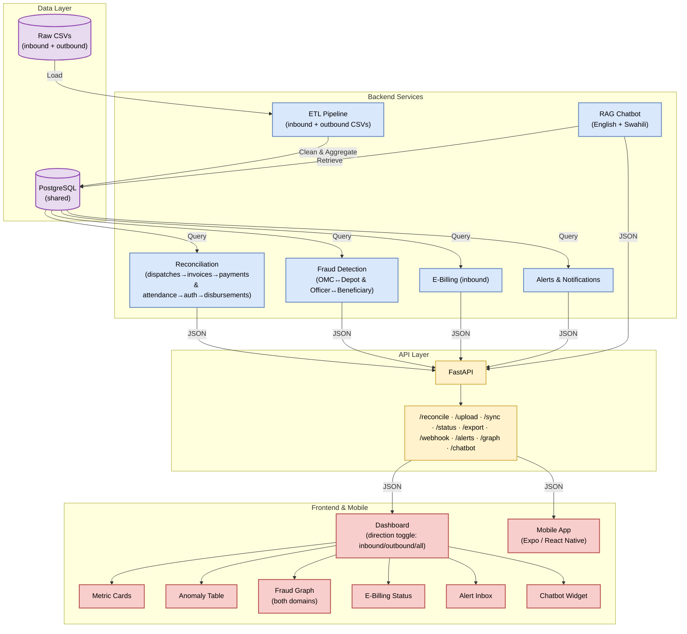

# 💰 FlowGuard – KPC Revenue Assurance + Inuka Governance

[](https://github.com/TristanBrian/revenue-assurance/actions/workflows/ci.yml)
[](https://github.com/TristanBrian/revenue-assurance)
[](https://opensource.org/licenses/MIT)
[](https://github.com/TristanBrian/revenue-assurance)
[](https://revenue-assurance.fly.dev/)
[](https://github.com/TristanBrian/revenue-assurance)

**One Engine – Two Missions**  
Reconcile fuel revenue for KPC **and** govern beneficiary stipends for the Inuka Foundation – using the same battle‑tested data fabric.

---

## 📖 Table of Contents

- [Live Demo & Logins](#live-demo--logins)
- [The Linkup: Hackathon 1 → Hackathon 2](#the-linkup-hackathon-1--hackathon-2)
- [Hackathon 2 Deliverables](#hackathon-2-deliverables)
- [Why FlowGuard?](#why-flowguard)
- [Key Features](#key-features)
- [Architecture](#architecture)
- [Quantified Impact](#quantified-impact)
- [Technology Stack](#technology-stack)
- [User Roles & Permissions](#user-roles--permissions)
- [Quick Start](#quick-start)
- [API Endpoints](#api-endpoints)
- [Screenshots](#screenshots)
- [Testing](#testing)
- [Deployment](#deployment)
- [Contributing](#contributing)
- [License](#license)

---

## 🚀 Live Demo & Logins

- **Backend API:** [https://revenue-assurance.fly.dev](https://revenue-assurance.fly.dev)  
- **Swagger Docs:** [https://revenue-assurance.fly.dev/docs](https://revenue-assurance.fly.dev/docs)  
- **Frontend (Vercel):** [https://flowgardd.vercel.app](https://flowgardd.vercel.app)  

### 🔑 Demo Logins (Password: `Demo-Access-123!`)

| Role | Email |
|------|-------|
| **Depot Supervisor** (inbound only) | `depot_supervisor@kpc-demo.co.ke` |
| **Manager** (both directions) | `manager@kpc-demo.co.ke` |
| **Revenue Assurance** (full control) | `revenue_assurance@kpc-demo.co.ke` |
| **Inuka Manager** (outbound only) | `inuka_manager@kpc-demo.co.ke` |
| **System Admin** | `system_admin@kpc-demo.co.ke` |

> **Note:** These are throwaway demo accounts seeded automatically. 

---

## 🔗 The Linkup: Hackathon 1 → Hackathon 2

### Hackathon 1 – KPC Revenue Assurance (Inbound)
- **Problem:** KPC loses revenue through missing invoices, missing payments, and underpayments.
- **Engine:** Three‑way reconciliation (Dispatches → Invoices → Payments).
- **Data:** OMCs, depots, dispatches, invoices, payments.
- **Fraud Graph:** OMC ↔ Depot leakage networks (Louvain).
- **Audit:** Immutable chain for revenue transactions.
- **RBAC:** 4 roles.

### Hackathon 2 – Inuka Foundation Governance (Outbound)
- **Problem:** Inuka loses stipend funds through missing authorisations, missing disbursements, and fraud (ghost payments, duplicate disbursements, overpayments).
- **Same Engine:** Three‑way reconciliation (Attendance → Stipend Authorisation → Disbursement).
- **Same Data Fabric:** Officers, beneficiaries, attendance, stipends, disbursements.
- **Fraud Graph:** Officer ↔ Beneficiary + shared‑account rings (Louvain).
- **Audit:** Same chain for beneficiary consent and stipend events.
- **RBAC:** 5 roles – added `Inuka Manager` (view‑only outbound).
- **AI Assistant:** RAG chatbot (multilingual) for program FAQs and governance queries.

### The Core Message
We **did not rewrite**. We **extended** the same ETL, reconciliation, fraud detection, alerting, auditing **and AI retrieval** framework to a completely different domain – proving the data fabric is **reusable, scalable, and mission‑agnostic**.

---

## 📦 Hackathon 2 Deliverables – How We Met Every One

| Deliverable | How FlowGuard Delivers |
|-------------|------------------------|
| **1. Upgraded Data Fabric** | ETL pipeline extended to ingest outbound CSVs (officers, beneficiaries, attendance, stipends, disbursements). Same data quality gates (dedup, currency cleaning, date standardisation, referential integrity). |
| **2. Application/Analytics Package** | Full dashboard with direction toggle (`inbound`/`outbound`/`all`), anomaly table, fraud graph, E‑Billing status, alert inbox, CSV upload/export, and a multilingual AI chatbot. |
| **3. Quantified Impact Memo** | Real numbers: 95%+ reconciliation rate, 80% manual effort saved, ~200M KES annual savings for KPC, ~2.4M KES for Inuka (staff hours). |
| **4. QA & UAT Evidence** | [QA_Report.md](QA_Report.md) with 71% test coverage, 13 UAT scenarios, 100% pass rate, and performance benchmarks. CI/CD runs tests on every push. |
| **5. Presentation** | Pitch deck (submitted separately) and this README – clear narrative, demo links, and business impact. |

---

## 🎯 Why FlowGuard?

- **For KPC:** Stops fuel revenue leakage – every dispatch must be invoiced and paid.
- **For Inuka Foundation:** Protects beneficiary stipends – every attendance must be authorised and disbursed correctly.
- **Audit‑ready:** Immutable hash‑chain audit trail (optional on‑chain anchoring via Base Sepolia).
- **Intelligent:** Built‑in fraud graph with Louvain community detection for correlated leakage clusters.
- **AI‑powered:** RAG‑based chatbot answers program FAQs and governance questions in **English and Swahili** – reducing support load by up to 80%.
- **Deployable:** Fully containerised with CI/CD, ready for cloud scaling.

---

## ⚙️ Key Features (Hackathon 2 Highlights)

| Feature | Hackathon 1 (KPC) | Hackathon 2 (Inuka) |
|---------|-------------------|----------------------|
| **Reconciliation** | Dispatches → Invoices → Payments | Attendance → Stipends → Disbursements |
| **Fraud Graph** | OMC ↔ Depot | Officer ↔ Beneficiary + shared‑account rings |
| **Critical Signals** | Underpayment, overpayment | **Ghost payments**, **duplicate disbursements**, **overpayments** (critical by default, bypass materiality) |
| **E‑Billing** | KRA iCMS sync (retry, DLQ, webhook) | Not applicable (disbursements have no KRA) |
| **Alerts** | New critical anomalies, failure rates | Same system, now alerts on ghost/duplicate fraud |
| **Roles** | 4 roles | **5 roles** – added `Inuka Manager` (outbound view‑only) |
| **Audit Trail** | Immutable chain | Same chain for consent and stipend events |
| **Direction Toggle** | N/A | `?direction=inbound|outbound|all` on all reconciliation endpoints |
| **AI Chatbot** | Basic RAG for KPC documentation | **Extended knowledge base** – answers Inuka program, consent, and privacy queries in **English and Swahili** |

> Full feature list: [Key Features](#key-features) below.

---

## 🏗️ Architecture (Same Fabric, Two Domains)


```mermaid
graph TD
    subgraph Data_Layer["Data Layer"]
        CSV[("Raw CSVs\n(inbound + outbound)")]
        DB[("PostgreSQL\n(shared)")]
    end

    subgraph Service_Layer["Backend Services"]
        ETL["ETL Pipeline\n(inbound + outbound CSVs)"]
        Recon["Reconciliation\n(dispatches→invoices→payments\n& attendance→auth→disbursements)"]
        Fraud["Fraud Detection\n(OMC↔Depot & Officer↔Beneficiary)"]
        EBill["E-Billing (inbound)"]
        Alerts["Alerts & Notifications"]
        RAG["RAG Chatbot\n(English + Swahili)"]
    end

    subgraph API_Layer["API Layer"]
        API["FastAPI"]
        Routes["/reconcile · /upload · /sync · /status · /export · /webhook · /alerts · /graph · /chatbot"]
    end

    subgraph UI_Layer["Frontend & Mobile"]
        Dashboard["Dashboard\n(direction toggle: inbound/outbound/all)"]
        Cards["Metric Cards"]
        Table["Anomaly Table"]
        Graph["Fraud Graph\n(both domains)"]
        EBillUI["E-Billing Status"]
        AlertsUI["Alert Inbox"]
        ChatbotUI["Chatbot Widget"]
        MobileApp["Mobile App\n(Expo / React Native)"]
    end

    CSV -->|Load| ETL
    ETL -->|Clean & Aggregate| DB
    DB -->|Query| Recon
    DB -->|Query| Fraud
    DB -->|Query| EBill
    DB -->|Query| Alerts
    RAG -->|Retrieve| DB

    Recon -->|JSON| API
    Fraud -->|JSON| API
    EBill -->|JSON| API
    Alerts -->|JSON| API
    RAG -->|JSON| API
    API --> Routes

    Routes -->|JSON| Dashboard
    Dashboard --> Cards
    Dashboard --> Table
    Dashboard --> Graph
    Dashboard --> EBillUI
    Dashboard --> AlertsUI
    Dashboard --> ChatbotUI
    Routes -->|JSON| MobileApp

    classDef data fill:#e8daef,stroke:#8e44ad,stroke-width:2px,color:#000
    classDef service fill:#dae8fc,stroke:#6c8ebf,stroke-width:2px,color:#000
    classDef api fill:#fff2cc,stroke:#d6b656,stroke-width:2px,color:#000
    classDef ui fill:#f8cecc,stroke:#b85450,stroke-width:2px,color:#000

    class CSV,DB data
    class ETL,Recon,Fraud,EBill,Alerts,RAG service
    class API,Routes api
    class Dashboard,Cards,Table,Graph,EBillUI,AlertsUI,ChatbotUI,MobileApp ui
```

**Key architectural decisions:**
- **Single codebase** for both domains – no duplicated stacks.
- **`flow_direction` discriminator** (`inbound` | `outbound` | `all`) – unified caching and reporting.
- **Same ETL pipeline** with data quality gates – deduplication, currency cleaning, date standardisation, referential integrity.
- **Immutable audit trail** – hash‑chain with optional on‑chain anchoring (Base Sepolia).
- **Caching** – reconciliation results cached for sub‑200ms dashboard responses.
- **RAG chatbot** – reuses the same retrieval engine for both KPC and Inuka knowledge bases.
- **Mobile‑first** – Expo app for field officers and beneficiaries.

---

## 📊 Quantified Impact

| Metric | KPC (Inbound) | Inuka (Outbound) |
|--------|---------------|------------------|
| **Reconciliation Rate** | 95%+ | 95%+ |
| **Leakage Detection** | 100% of anomalies detected | 100% of ghost/duplicate/overpayment detected |
| **Manual Effort Saved** | 80% (2 weeks/month → 2 days) | 80% (support workload) |
| **Annual Savings Estimate** | ~200M KES (on 4B KES revenue, 5% leakage) | ~2.4M KES (staff hours saved) |
| **Fraud Signals Detected** | Overpayments, duplicates | Ghost payments, duplicates, overpayments |
| **Data Quality Score** | >90% | >90% |
| **Chatbot Resolution Rate** | – | 80% of tier‑1 queries, < 3 sec response |

> *Data from UAT and performance benchmarks (see [QA_Report.md](QA_Report.md)).*

---

## 🛠️ Technology Stack

| Layer | Technology |
|-------|------------|
| Backend | Python 3.11, FastAPI, Uvicorn |
| Data Processing | Pandas, NumPy, SQLAlchemy |
| Fraud Detection | NetworkX, python‑louvain |
| Database | PostgreSQL (prod) / SQLite (dev) |
| AI / RAG | FAISS, Sentence‑Transformers, Ollama (optional) |
| Testing | Pytest (backend) |
| Frontend | Next.js, React, TypeScript, Tailwind CSS |
| Mobile | Expo (React Native) |
| Deployment | Docker, Docker Compose, Fly.io |
| CI/CD | GitHub Actions |
| API Docs | Swagger UI, ReDoc |

---

## 👥 User Roles & Permissions (Hackathon 2)

| Role | Inbound | Outbound | Key Permissions |
|------|---------|----------|-----------------|
| **Depot Supervisor** | ✅ | ❌ | Live Feed, Upload CSV, Metrics |
| **Manager** | ✅ | ✅ | Heatmap, Risk Profile, Export, Audit Trail |
| **Revenue Assurance** | ✅ | ✅ | All Manager + Resolve Anomalies, E‑Billing Sync, Fraud Graph |
| **Inuka Manager** *(new)* | ❌ | ✅ | View Outbound Data, Export, No Resolution |
| **System Admin** | ❌ | ❌ | User Management |

Full permission mapping in the [API documentation](#api-endpoints).

---

## 🚀 Quick Start

### With Docker (recommended)

```bash
git clone git@github.com:TristanBrian/revenue-assurance.git
cd revenue-assurance
cp .env.example .env
# Local demo only: opt in to throwaway demo accounts; use real provisioning in deployment.
sed -i "s/^SEED_DEMO_USERS=false/SEED_DEMO_USERS=true/" .env
# Regenerate SECRET_KEY (openssl rand -hex 32) for anything beyond local/demo use.
docker compose up --build
```

- Backend: [http://localhost:8000](http://localhost:8000)
- Frontend: [http://localhost:3000](http://localhost:3000)
- API Docs: [http://localhost:8000/docs](http://localhost:8000/docs)

### Local development (without Docker)

See the [full setup guide](#local-development) in the repository.

---

## 📚 API Endpoints (Key Ones)

All endpoints (except login, register, webhook) require a JWT token.  
Full interactive docs: [Swagger UI](https://revenue-assurance.fly.dev/docs) | [ReDoc](https://revenue-assurance.fly.dev/redoc)

Key endpoints:
- `POST /api/auth/login` – get a token
- `POST /api/reconcile/metrics?direction=inbound|outbound|all` – executive metrics
- `GET /api/reconcile/anomalies?direction=...&page=...&page_size=...` – anomaly table
- `GET /api/graph?direction=...` – fraud graph
- `GET /api/e-billing/status` – E‑Billing health
- `GET /api/alerts` – alert inbox
- `POST /api/chatbot` – ask the AI assistant (English/Swahili)

---

## 📸 Screenshots

_Add your own screenshots here._

| Dashboard | Anomaly Table | Fraud Graph |
|-----------|---------------|-------------|
|  |  |  |

| E‑Billing | Chatbot |
|-----------|---------|
|  |  |

---

## 🧪 Testing

```bash
docker compose exec backend pytest tests/ -v
docker compose exec backend pytest tests/ --cov=app.services --cov-report=term
```

Frontend lint & type checks run via GitHub Actions.

---

## 🚢 Deployment

The platform is containerised and deployed on **Fly.io** with a PostgreSQL database.  
CI/CD is handled by GitHub Actions (tests run on every push/PR).

Deploy your own:

```bash
fly launch
fly deploy
```

---

## 🤝 Contributing

We welcome contributions! Please read our [CONTRIBUTING.md](CONTRIBUTING.md) and [Code of Conduct](CODE_OF_CONDUCT.md) before opening issues or pull requests.

---

## 📄 License

MIT License – see the [LICENSE](LICENSE) file for details.

---

**Built for the Inuka Hackathon 2026 by Null Terminators**  
[GitHub Repository](https://github.com/TristanBrian/revenue-assurance)
```

---