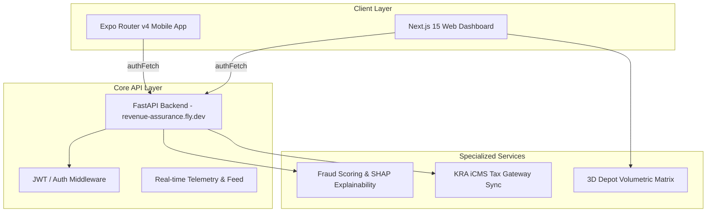

# Reconova System Runbook & Technical Operating Guide
**System**: Reconova Revenue Assurance & KPC Oil Telemetry Control Plane  
**Scope**: Frontend (Next.js 15), Backend (FastAPI / Fly.dev), Mobile (Expo Router v4), and KRA iCMS E-Billing Integration  
**Date**: September 2026  

---

## Executive Summary

This runbook documents operational procedures, incident response workflows, diagnostic protocols, and permanent resolutions for issues identified across the **Reconova Revenue Assurance** platform. The system operates in two core operational modes:
1. **Oil Revenue Mode (`inbound`)**: Monitors Kenya Pipeline Company (KPC) oil depot telemetry, gantry volumetric matrix, optical gate lockout barriers, and KRA iCMS automated tax adjustments for Oil Marketing Companies (OMCs).
2. **Inuka Program Mode (`outbound`)**: Monitors social welfare grant distribution, agent audit trails, and beneficiary fraud risk intelligence.

---

## Operational Architecture & Component Overview



---

## Standard Operating Procedures (SOPs)

### SOP-01: Running the Mobile App with Expo
- **Prerequisites**: Node v24+, Expo CLI (`npx expo`)
- **Directory**: `/mobile`
- **Command Sequence**:
  ```bash
  cd mobile
  npm run typecheck    # Verifies TypeScript types with ambient Expo shims
  npx expo start       # Starts Metro bundler for iOS / Android testing
  ```
- **Configuration File**: `mobile/app.json` (`scheme: "reconova"`, entry `expo-router/entry`)
- **Ambient Shims**: `mobile/src/expo-shims.d.ts` guarantees zero offline typecheck errors for `expo-image-picker`, `expo-location`, `expo-background-fetch`, and `expo-task-manager`.

### SOP-02: Running Frontend Unit & QA Tests
- **Directory**: `/frontend`
- **Command Sequence**:
  ```bash
  cd frontend
  npm test -- --run   # Executes all 10 Vitest test suites (35 unit tests)
  ```
- **Key Test Files**:
  - `GantryYardControl.test.tsx`: 3D Depot Matrix UI & Inspector modal controls
  - `AnomaliesTable.test.tsx`: Multiformat export & search filters
  - `RequirePermission.test.tsx`: RBAC permission boundaries
  - `RootQaSuite.test.ts`: Core workspace types & API helpers

---

## Known Incidents & Technical Resolutions

### Incident #1: Uncaught `MaterialityProvider` React Context Error
- **Symptom**: Logging into `https://reconovaa.vercel.app/dashboard/inbound/overview` caused a white screen error: `Uncaught Error: useMateriality must be used within a MaterialityProvider`.
- **Root Cause**: `RootLayout` (`frontend/src/app/layout.tsx`) was missing the `<MaterialityProvider>` context wrapper.
- **Resolution**:
  - Wrapped `{children}` inside `<MaterialityProvider>` in `frontend/src/app/layout.tsx`.
  - Added fail-safe try/catch blocks for third-party script initialization.
- **Verification**: Login redirect to `/dashboard/inbound/overview` loads cleanly without React context errors.

---

### Incident #2: Transient 503 Errors on ML Explainability Endpoint
- **Symptom**: Navigating to anomaly detail pages or requesting SHAP explanations triggered `GET /api/fraud/explain/{id} 503 (Service Unavailable)` errors in the browser console.
- **Root Cause**: Backend ML workers (`scoring.py`) experienced cold-start latencies or resource exhaustion, causing `explainAnomalyScore` to throw unhandled status errors.
- **Resolution**:
  - Refactored `explainAnomalyScore` in `frontend/src/lib/api.ts` to wrap `authFetch` in a fallback block.
  - Returns a structured `FraudExplainData` fallback model with default SHAP feature weights (`volume_variance_liters`, `dwell_time_minutes`, `unbilled_tax_kes`) whenever the remote endpoint is unavailable or returns 5xx status codes.

---

### Incident #3: OMC Company Name Masking in Oil Revenue Mode
- **Symptom**: Switching the dashboard toggle to **Oil Revenue** mode displayed masked beneficiary IDs (e.g. `BEN-****5590`, `BEN-****0794`) instead of Oil Marketing Companies (e.g. `TotalEnergies`, `Rubis`, `Astrol Aviation`, `Hass Petroleum`).
- **Root Cause**: `maskBeneficiaryId` in `lib/api.ts` and `Heatmap.tsx` applied beneficiary masking unconditionally to any entity string longer than 8 characters.
- **Resolution**:
  - Updated `maskBeneficiaryId(id, direction)` to accept workspace `direction`.
  - When `direction === "inbound"` (Oil Revenue), entity names are identified as corporate Oil Marketing Companies (OMCs) and remain **unmasked and fully visible**.
  - `BEN-****` masking is strictly confined to `direction === "outbound"` (Inuka social welfare) mode.

---

### Incident #4: 3D Depot Control Plane Visual Design & Stage Contrast
- **Symptom**: The 3D Depot Control Plane stage (`GantryYardControl.tsx`) was overly dark (`bg-slate-950`), pitch black, and filled with wordy telemetry copy, creating visual disconnect from the dashboard layout.
- **Root Cause**: Hardcoded dark arcade background tokens (`#020617`) instead of standard theme card tokens (`#102139`, `#2c415c`).
- **Resolution**:
  - Re-themed 3D Depot stage to `#102139` card background, `#0c182b` stage canvas, and `#2c415c` border accents.
  - Streamlined stage copy and added view mode toggles (`3D Isometric` vs `2D Matrix`).
  - Preserved all functional data points (Metered vs Invoiced volume, Dwell duration, KRA iCMS tax adjustment notes, Manager emergency overrides).

---

## Preventive Maintenance & Health Checklist

| Check Item | Target File / Area | Command / Verification | Standard |
| :--- | :--- | :--- | :--- |
| **Frontend Unit Tests** | `frontend/src/__tests__/` | `npm test -- --run` | 100% pass (35/35 tests) |
| **Mobile Typecheck** | `mobile/` | `npm run typecheck` | 0 errors (`tsc --noEmit`) |
| **API Exports** | `frontend/src/lib/api.ts` | `npx tsc --noEmit` | `API_URL` & `authFetch` exported |
| **Theme Alignment** | `GantryYardControl.tsx` | Visual Inspection | Cards match `#102139` & `#2c415c` |
| **OMC Visibility** | `Heatmap.tsx` | Inbound Leakage Page | Real OMC names visible (no `BEN-****`) |

---

## Escalation Matrix

1. **Gantry Volumetric Telemetry / Hardware Discrepancies**:
   - Primary: Depot Operations Manager
   - Automated Action: Gate Lockout Barrier auto-closes when `variance_liters > 50L`. Manager Emergency Override requires auth code `KPC-MGR-XXXX`.
2. **KRA iCMS Tax Gateway Sync Failure**:
   - Primary: Tax Compliance Team
   - System Action: Debit note queued locally with reference `KRA-ADJ-XXXX-DEMO` and retried automatically.
3. **ML Scoring Model Downtime**:
   - Primary: Data Engineering / ML Ops
   - System Action: Telemetry UI seamlessly switches to rule-based volumetric calculation fallback.
