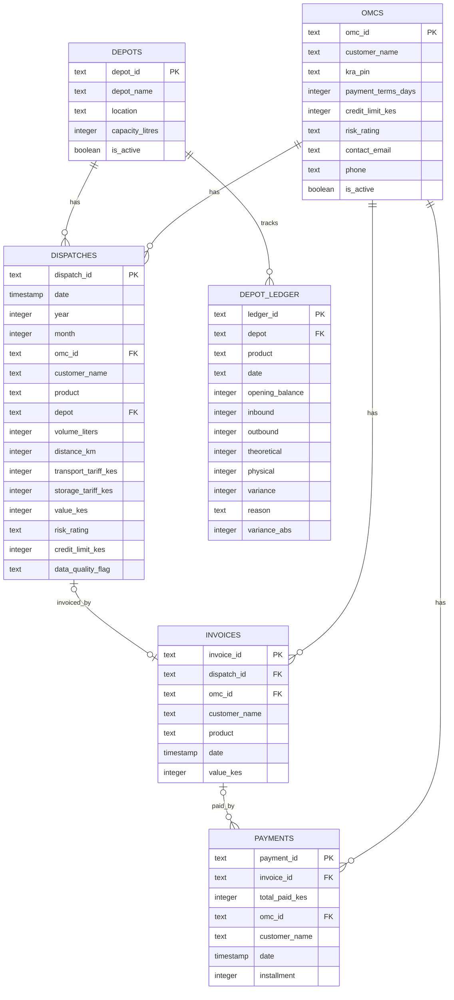

# Reconciliation domain schema

Six tables cover the Order-to-Cash reconciliation domain: two master-data
tables (`omcs`, `depots`) and four raw transactional tables
(`dispatches`, `invoices`, `payments`, `depot_ledger`). The DDL lives in
[`schema.sql`](schema.sql); the matching SQLAlchemy ORM classes each live in
their own file under `app/models/` — one class per file:
[`omc.py`](app/models/omc.py), [`depot.py`](app/models/depot.py),
[`dispatch.py`](app/models/dispatch.py), [`invoice.py`](app/models/invoice.py),
[`payment.py`](app/models/payment.py),
[`depot_ledger.py`](app/models/depot_ledger.py).
`app/models/reconciliation.py` itself is an empty placeholder (like
`audit.py`/`transactions.py`) — "reconciliation" isn't a table, just the
domain name these six files together represent.

## Reading the relationships

- **`OMCS ||--o{ DISPATCHES`** (and `INVOICES`, `PAYMENTS`) — one OMC to
  zero-or-many of each. An OMC can have no dispatches yet (new customer),
  but every dispatch/invoice/payment traces back to exactly one OMC via
  `omc_id`.
- **`DEPOTS ||--o{ DISPATCHES`** / **`DEPOTS ||--o{ DEPOT_LEDGER`** — same
  shape: one depot, many dispatches/ledger entries.
- **`DISPATCHES |o--o| INVOICES`** (zero-or-one to zero-or-one) — this is
  the reconciliation engine's core signal. A dispatch with no matching
  invoice (`invoices.dispatch_id IS NULL` for that dispatch) is a **ghost
  load** — fuel left the depot but was never billed. See
  `services/reconciliation.py`'s `break_type = 'Missing Invoice'`.
- **`INVOICES |o--o{ PAYMENTS`** (zero-or-one to zero-or-many) — an invoice
  can be paid in installments, so multiple payment rows can share one
  `invoice_id`. `scripts/etl_pipeline.py` aggregates these
  (`groupby('invoice_id')`) into a single `total_paid_kes` before
  reconciliation runs. An invoice with zero payments is a **missing
  payment** break; a payment with `invoice_id IS NULL` is unmatched/
  unallocated money that can't be reconciled to anything yet.

## Nullability rule

- **`omcs`** = master data, assumed pre-existing/curated → identity fields
  (`customer_name`, `kra_pin`) are `NOT NULL`.
- **`dispatches` / `invoices` / `payments` / `depot_ledger`** = raw
  transactional data → only the primary key is `NOT NULL`. Nulls elsewhere
  are expected and meaningful, not data-quality bugs — a null
  `invoices.dispatch_id` or `payments.invoice_id` *is* the anomaly the
  reconciliation engine is built to find.

## What's real vs. reference-only right now

- **`schema.sql`** is DDL documentation only — it has not been applied to
  the live `kpc` Postgres database, and nothing reads it. The app currently
  builds these 6 tables at runtime via `scripts/etl_pipeline.py`'s
  `pandas.to_sql(if_exists='replace')`, which infers column types from the
  DataFrame rather than this explicit DDL.
- The 6 ORM classes above are real and verified (import correctly — both
  together via `app.models` and individually in isolation — build matching
  table metadata, relationships traverse correctly including the
  one-to-one dispatch↔invoice and the one-to-many invoice↔payments/
  installments case). But **`app/services/reconciliation.py` doesn't use
  them** — it still loads these tables via raw
  `pd.read_sql("SELECT * FROM dispatches", engine)` and computes
  everything in pandas. Adding the ORM models doesn't change that; wiring
  the service layer to use them instead of raw SQL is a separate,
  not-yet-done step.
- **`depot_ledger`** is loaded into the DB by the ETL pipeline but isn't
  read by any service or route today — it's present and populated, just
  unused by the app's logic currently.
- **`ebilling_sync`, `ebilling_dlq`, `ebilling_webhook_log`** are *not* in
  `schema.sql` or any file under `app/models/`. They're real persisted
  tables too (created by `services/e_billing.py`'s `init_ebilling_tables()`
  at first use), just not captured as version-controlled DDL/ORM classes
  here. The only genuinely in-memory, non-persisted piece in the app is the
  async task tracker (`task_status`, a plain dict backing
  `/e-billing/sync/async` polling).
