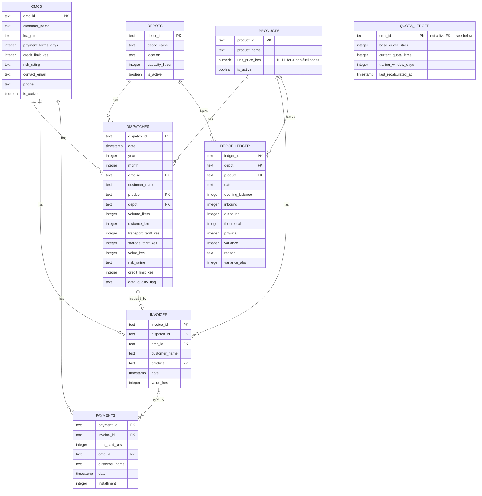

# Reconciliation domain schema

Eight tables: three master-data tables (`omcs`, `depots`, `products`), four
raw transactional tables (`dispatches`, `invoices`, `payments`,
`depot_ledger`), and one forward-looking state table (`quota_ledger`). The
DDL lives in [`schema.sql`](schema.sql); the matching SQLAlchemy ORM classes
each live in their own file under `app/models/` — one class per file:
[`omc.py`](app/models/omc.py), [`depot.py`](app/models/depot.py),
[`product.py`](app/models/product.py),
[`dispatch.py`](app/models/dispatch.py), [`invoice.py`](app/models/invoice.py),
[`payment.py`](app/models/payment.py),
[`depot_ledger.py`](app/models/depot_ledger.py),
[`quota_ledger.py`](app/models/quota_ledger.py).
`app/models/reconciliation.py` itself is an empty placeholder (like
`audit.py`/`transactions.py`) — "reconciliation" isn't a table, just the
domain name these files together represent.

(`QUOTA_LEDGER` has no drawn relationship line to `OMCS` above — see why
under "What's real vs. reference-only" below.)

## Reading the relationships

- **`OMCS ||--o{ DISPATCHES`** (and `INVOICES`, `PAYMENTS`) — one OMC to
  zero-or-many of each. An OMC can have no dispatches yet (new customer),
  but every dispatch/invoice/payment traces back to exactly one OMC via
  `omc_id`.
- **`DEPOTS ||--o{ DISPATCHES`** / **`DEPOTS ||--o{ DEPOT_LEDGER`** — same
  shape: one depot, many dispatches/ledger entries.
- **`PRODUCTS ||--o{ DISPATCHES`** (and `INVOICES`, `DEPOT_LEDGER`) — one
  product code to zero-or-many of each. `product_id` is the bare official
  KPC/EPRA fuel code (`PMS`/`AGO`/`DPK`) plus 4 non-fuel codes
  (`JETA1`/`HFO`/`LPG`/`LUB`, two of which are used for fraud injection in
  `scripts/generate_kpc_data.py`) — see `product.py`'s docstring for why
  all 7 exist here, not just the 3 official fuels.
- **`DISPATCHES |o--o| INVOICES`** (zero-or-one to zero-or-one) — this is
  the reconciliation engine's core signal. A dispatch with no matching
  invoice (`invoices.dispatch_id IS NULL` for that dispatch) is a **ghost
  load** — fuel left the depot but was never billed. See
  `services/reconciliation.py`'s `break_type = 'Missing Invoice'`.
- **`INVOICES |o--o{ PAYMENTS`** (zero-or-one to zero-or-many) — an invoice
  can be paid in installments, so multiple payment rows can share one
  `invoice_id`. `scripts/etl_pipeline.py` aggregates these
  (`groupby('invoice_id')`) into a single `total_paid_kes` before
  reconciliation runs. An invoice with zero payments is a **missing
  payment** break; a payment with `invoice_id IS NULL` is unmatched/
  unallocated money that can't be reconciled to anything yet.
- **`quota_ledger`** — one row per OMC (`omc_id` is its primary key), but
  deliberately *not* wired as a relationship to `OMCS` at all — see below.

## Nullability rule

- **`omcs` / `products`** = master data, assumed pre-existing/curated →
  identity fields (`customer_name`, `kra_pin`, `product_name`) are
  `NOT NULL`. `products.unit_price_kes` is the one exception within
  "master data" — nullable, since only the 3 real fuel codes have an actual
  price basis in this dataset.
- **`dispatches` / `invoices` / `payments` / `depot_ledger`** = raw
  transactional data → only the primary key is `NOT NULL`. Nulls elsewhere
  are expected and meaningful, not data-quality bugs — a null
  `invoices.dispatch_id` or `payments.invoice_id` *is* the anomaly the
  reconciliation engine is built to find.
- **`quota_ledger`** = forward-looking application state, not
  synthetic/curated data → only `omc_id` (its PK) is `NOT NULL`; everything
  else is nullable since nothing populates it yet.

## What's real vs. reference-only right now

- **`schema.sql`** is DDL documentation only for 7 of its 8 tables — it has
  not been applied to the live `kpc` Postgres database for `omcs`,
  `depots`, `products`, `dispatches`, `invoices`, `payments`, or
  `depot_ledger`. The app builds those at runtime via
  `scripts/etl_pipeline.py`'s `pandas.to_sql(if_exists='replace')`, which
  infers column types from the DataFrame rather than this explicit DDL
  (and creates plain, unconstrained tables — none of the `REFERENCES`
  above are live constraints for those 7).
- **`quota_ledger` is the one exception**: it's genuinely Alembic-managed
  and has actually been applied (`alembic upgrade head`,
  `alembic/versions/e3e5732b72b4_create_quota_ledger_table.py`). There's no
  ETL generator producing quota data, so unlike the other 7 tables it
  doesn't compete with that mechanism.
- **`quota_ledger.omc_id` is deliberately not a foreign key to `omcs`**,
  even though every row conceptually belongs to one OMC. `omcs` gets
  dropped and recreated by `etl_pipeline.py`'s `to_sql(if_exists='replace')`
  every run (no `CASCADE`) — a live FK from an Alembic-managed table would
  make Postgres block that `DROP TABLE` on every future ETL run. Same
  trade-off already made for `anomaly_resolutions.dispatch_id`: no DB-level
  referential integrity, so a `quota_ledger` row can reference an `omc_id`
  that no longer exists after an ETL re-run. No ORM `relationship()`
  either, for the same reason `anomaly_resolution.py` has none.
- The 7 ETL-owned ORM classes are real and verified (import correctly —
  together via `app.models` and individually in isolation — build matching
  table metadata; relationships traverse correctly including the
  one-to-one dispatch↔invoice, one-to-many invoice↔payments/installments,
  and product↔dispatches/invoices/depot_ledger cases; zero orphaned
  `dispatches.product`/`invoices.product` values against `products` after
  regenerating synthetic data). But **`app/services/reconciliation.py`
  doesn't use any of them** — it still loads these tables via raw
  `pd.read_sql("SELECT * FROM dispatches", engine)` and computes
  everything in pandas. Adding the ORM models doesn't change that; wiring
  the service layer to use them instead of raw SQL is a separate,
  not-yet-done step.
- **`depot_ledger`** is loaded into the DB by the ETL pipeline but isn't
  read by any service or route today — it's present and populated, just
  unused by the app's logic currently.
- **`quota_ledger`** has no service, route, or recalculation job reading or
  writing it yet either — only the schema exists, same status as
  `audit.py`/`transactions.py`'s empty model placeholders, except this one
  actually has a real table behind it already.
- **`ebilling_sync`, `ebilling_dlq`, `ebilling_webhook_log`** are *not* in
  `schema.sql` or any file under `app/models/`. They're real persisted
  tables too (created by `services/e_billing.py`'s `init_ebilling_tables()`
  at first use), just not captured as version-controlled DDL/ORM classes
  here. The only genuinely in-memory, non-persisted piece in the app is the
  async task tracker (`task_status`, a plain dict backing
  `/e-billing/sync/async` polling).
